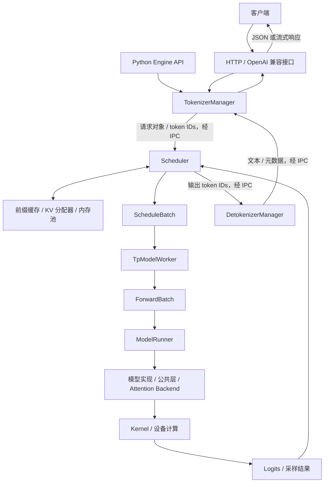
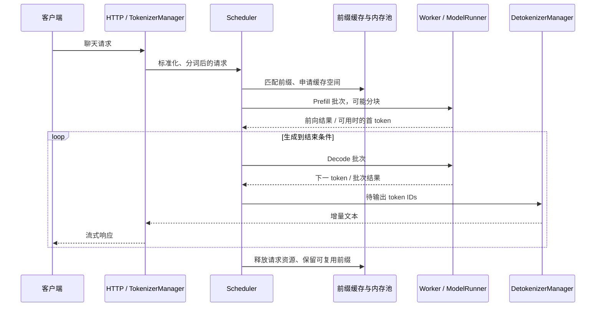

# SGLang 架构学习指南

本文基于当前本地仓库源码，提交号 `03d06a764e4a83268eefd1bafc676418f7269c89`，整理日期为 2026-09-09。重点讲解自回归大语言模型的 Python SRT 推理链路，并交代多模态、分布式和 Rust 组件的位置。不同模型、硬件和启动选项会选择不同分支；文中的流程图是便于学习的主路径。

## 1. 先建立整体认识

SGLang 是模型推理服务框架。模型本身负责“给定输入，计算输出”，SGLang 负责把大量请求有效地组织起来：解析输入、调度请求、管理 KV Cache、执行模型、采样以及流式返回。

理解它可以先抓住三个问题：

1. **请求如何流转？** 看 HTTP 接口、TokenizerManager、Scheduler 和 DetokenizerManager。
2. **GPU 每轮执行什么？** 看 ScheduleBatch、TpModelWorker、ForwardBatch 和 ModelRunner。
3. **历史计算如何复用？** 看前缀缓存、KV 槽位分配器和实际存储张量的内存池。

仓库中的 `lang/` 是生成程序的前端 DSL，`srt/` 是服务运行时。调用 OpenAI 兼容接口或 Python Engine，并不需要经过 DSL。

## 2. 仓库地图

以下路径均相对于仓库根目录。

| 路径 | 职责 | 初学时如何看 |
|---|---|---|
| `python/sglang/cli/`、`launch_server.py` | 命令入口、选择服务启动方式 | 了解启动路由 |
| `python/sglang/lang/` | DSL API、IR、解释器、远程后端 | 使用生成程序时再深入 |
| `python/sglang/srt/entrypoints/` | HTTP、OpenAI 兼容接口、Engine、gRPC | 请求入口 |
| `python/sglang/srt/managers/` | 分词、调度、批次、worker、反分词 | 核心主线 |
| `python/sglang/srt/model_executor/` | 模型执行、ForwardBatch、图执行配套逻辑 | CPU 调度到设备执行的桥梁 |
| `python/sglang/srt/models/` | 各模型的推理实现 | 选一个熟悉的模型阅读 |
| `python/sglang/srt/model_loader/` | 模型和权重加载 | 理解初始化 |
| `python/sglang/srt/layers/` | Attention、MoE、量化等公共层 | 理解高性能实现 |
| `python/sglang/srt/mem_cache/` | 前缀缓存、分配器、KV/状态池、分层存储 | 第二条重点主线 |
| `python/sglang/srt/distributed/` | 分布式通信基础设施 | 多卡时深入 |
| `python/sglang/srt/disaggregation/` | Prefill/Decode 分离、编码器分离 | 集群部署时深入 |
| `python/sglang/srt/speculative/` | 推测解码 | 理解生成加速 |
| `python/sglang/srt/constrained/`、`sampling/` | 结构化约束和采样 | 理解输出如何确定 |
| `python/sglang/srt/multimodal/` | 多模态输入处理相关组件 | 图像、音视频输入时深入 |
| `python/sglang/kernels/` | 按算子组织的接口、JIT 基础设施和 AOT Kernel | 最后下钻 |
| `python/sglang/multimodal_gen/` | 图像、视频等生成运行时 | 独立的学习分支 |
| `sgl-model-gateway/` | 服务实例注册、路由、负载均衡、PD 编排 | 实例之上的网关层 |
| `rust/sglang-server/` | Rust HTTP 前端和请求处理管线 | Python 前端之外的实现路径 |
| `test/`、`benchmark/`、`examples/` | 测试、性能基准和使用示例 | 用行为反查实现 |

## 3. 核心架构图：请求、调度与计算



这张图同时包含进程间通信和进程内调用，不能把每个框都看成独立进程。

标准 Python 单 HTTP worker 路径下，HTTP 服务、Engine 和 TokenizerManager 位于主进程；Scheduler 和 DetokenizerManager 在子进程中。TpModelWorker、ModelRunner 是 Scheduler 侧的对象，通常不是额外启动的两个进程。多卡下会启动对应 rank 的 Scheduler/worker，具体拓扑还受 DP、PP、多 HTTP worker、Ray 等配置影响。

Engine 的类注释明确描述了这三个组件以及基于 ZeroMQ 的 IPC。模型并行 rank 之间还需要设备通信组，不能用前端 IPC 箭头代替全部分布式通信。

源码：[Engine](../python/sglang/srt/entrypoints/engine.py)、[HTTP Server](../python/sglang/srt/entrypoints/http_server.py)。

## 4. 一次聊天请求的完整生命周期

### 4.1 接入与标准化

HTTP 层接收请求。OpenAI 兼容适配层处理协议字段、聊天模板以及相应的输入转换，随后进入内部生成链路。原生 `/generate` 则直接使用内部生成请求接口。

`TokenizerManager.generate_request()` 管理请求生成过程，包括输入处理、分词、发送内部请求以及异步等待结果。它维护请求 ID 对应的状态，方便把后台返回的结果交还给正确的调用者。多模态请求还涉及 processor 等处理路径，不能简单视为对字符串调用一次 tokenizer。

### 4.2 排队、前缀匹配与准入

Scheduler 接收 tokenized 请求，维护等待和运行状态。准备新批次时，需要考虑可复用的前缀、剩余 KV 容量、请求数和 token 预算，以及当前运行批次。

前缀命中意味着对应的历史 KV 可以复用；未命中的输入部分仍需计算。即使完整 prompt 命中，也不能简单断言一定“零计算”：获得下一 token 的 logits、缓存粒度和具体路径仍可能要求处理尾部 token。

### 4.3 Prefill：处理输入上下文

Prefill 计算输入中尚未缓存的 token，并写入相应 KV。对普通自回归生成请求，处理到 prompt 末尾后，可根据最后位置的输出分布采样第一个生成 token。

源码中这类前向经常用 `EXTEND` 表示，因为它是在已有缓存前缀之后扩展序列。长 prompt 可以分块执行，单个中间 chunk 不等于已经完成整个 prompt，也不一定立即产生用户可见文本。

### 4.4 Decode：逐步生成

常规 Decode 每轮为一个活动请求处理一个新位置，读取之前缓存的 KV，然后得到下一 token。多个请求一起进入一个批次，以提高设备利用率。推测解码等路径会改变“一轮一个 token”的模式。

每轮结束后，Scheduler 更新请求状态，检查 EOS、停止条件或长度上限，移除完成请求，并根据策略接纳新请求。

### 4.5 输出与资源回收

Scheduler 通过结果处理和输出组件发送 token IDs；DetokenizerManager 将它们增量还原为文本；TokenizerManager 唤醒等待结果的调用端；HTTP 层返回 JSON 或流式事件。

请求完成后，请求相关资源需要释放；可复用的 KV 可以被前缀缓存保留，之后再按策略淘汰。因此“请求结束”不代表“所有 KV 立刻清空”。



序列图省略了首 token 的独立发送，以及 overlap 下计算与结果处理的交错。

源码：[TokenizerManager](../python/sglang/srt/managers/tokenizer_manager.py)、[请求数据结构](../python/sglang/srt/managers/io_struct.py)、[DetokenizerManager](../python/sglang/srt/managers/detokenizer_manager.py)。

## 5. Scheduler 为什么是核心

Scheduler 同时连接请求生命周期、显存预算和设备执行。它需要决定“谁能进入本轮、执行 Prefill 还是 Decode、如何处理上一轮结果”。

当前 `event_loop_normal()` 的主逻辑可以简化为：

```python
# 教学伪代码，省略暂停、退出、自检和异常处理。
while True:
    ingest_requests()
    plan = get_next_batch_to_run(running_batch, last_batch)
    running_batch = plan.running_batch
    batch = plan.batch_to_run
    if batch:
        result = run_batch(batch)
        process_batch_result(batch, result)
    else:
        on_idle()
    last_batch = batch
```

### Continuous Batching

连续批处理按推理迭代更新批次成员。一个请求完成后，其位置可以让给其他请求，而不需要等待最初同批的所有请求都结束。是否在某轮接纳新请求，仍取决于调度与资源约束。

### Chunked Prefill

把长输入拆成多个受预算约束的片段执行，限制单次 Prefill 工作量，为其他请求留下调度机会。它能缓解长 prompt 对延迟的影响，但片段大小、调度策略和硬件共同决定吞吐与延迟的取舍。

### Overlap Scheduler

`event_loop_overlap()` 利用结果队列，让 CPU 侧准备、结果处理与设备计算尽可能重叠。当前实现会提交当前批次，再处理上一批次的结果，并针对有依赖的采样进行相应安排。

这减少了关键路径上暴露的 CPU 开销，并不意味着 CPU 不再工作，或所有批次都可无条件重叠。代码中存在禁用某轮 overlap 的判断及同步处理。

源码：[Scheduler](../python/sglang/srt/managers/scheduler.py)，优先定位 `event_loop_normal`、`event_loop_overlap`、`get_next_batch_to_run`、`run_batch`；再看 [schedule_policy.py](../python/sglang/srt/managers/schedule_policy.py) 和 [结果处理组件](../python/sglang/srt/managers/scheduler_components/batch_result_processor.py)。

## 6. Req、ScheduleBatch 和 ForwardBatch 的区别

| 对象 | 关注点 | 典型内容 |
|---|---|---|
| `Req` | 一个请求从进入到结束的状态 | 输入和输出 token、采样要求、结束状态、缓存相关信息 |
| `ScheduleBatch` | 本轮调度的一组请求 | 请求集合、执行模式、批次资源和序列信息 |
| `ForwardBatch` | 模型前向所需的执行表示 | 输入张量、位置、序列长度、KV 写入位置、Attention 元数据 |

当前普通生成链路中，`TpModelWorker.forward_batch_generation()` 可以通过 `ForwardBatch.init_new(batch, model_runner, ...)` 从 ScheduleBatch 构建 ForwardBatch，然后调用 `model_runner.forward()`。随后执行采样，或在特定 overlap 场景延后采样。

三种对象对应“请求状态 → 调度计划 → 计算输入”。阅读旧资料时不要强行套用已经变化的中间 Batch 类型，应以当前 worker 的调用签名为准。

源码：[schedule_batch.py](../python/sglang/srt/managers/schedule_batch.py)、[tp_worker.py](../python/sglang/srt/managers/tp_worker.py)、[forward_batch_info.py](../python/sglang/srt/model_executor/forward_batch_info.py)。

## 7. KV Cache：把复用策略和物理存储分开理解

### 7.1 KV Cache 保存什么

对常见 Transformer Attention，每一层都会产生历史 token 的 Key 和 Value。后续 token 使用这些历史状态，避免反复计算整个已有上下文。

KV 内存通常随活动 token 数、层数、KV 头数、头维度以及存储精度增加。GQA、MLA、滑动窗口和混合状态模型会改变实际布局，不能用同一个简单容量公式覆盖全部模型。

### 7.2 三个不同职责

| 层次 | 回答的问题 | 当前代码入口 |
|---|---|---|
| 前缀缓存 | 哪段 token 前缀能复用？哪些缓存要保留或淘汰？ | `radix_cache.py`、`unified_cache/` |
| 分配策略与槽位分配器 | 本轮要申请多少位置？哪些位置空闲？ | `allocation.py`、`allocator/` |
| 请求映射与物理内存池 | 请求位置对应哪个槽位？KV 张量如何存放？ | `memory_pool.py` 及模型特定 pool 文件 |

请求到 token 槽位的映射、KV 槽位分配和实际 KV 张量存储是相关但不同的概念。Attention Backend 通过执行元数据找到所需位置。

**当前快照的一个细节：** `mem_cache/README.md` 展示了包含 `pool/` 的分层布局，但当前目录仍保留 `memory_pool.py`，`allocation.py` 和 `schedule_batch.py` 也从该文件导入 `ReqToTokenPool`。阅读架构说明时，要用实际文件与 import 交叉核对。

### 7.3 RadixAttention 与前缀复用

可以把 radix tree 理解为按 token 序列组织的压缩前缀树。假设两个请求分别为：

```text
请求 A：[共同系统提示词] + [问题 A]
请求 B：[共同系统提示词] + [问题 B]
```

若公共部分 token 完全匹配、缓存仍有效且满足相应约束，请求 B 可以复用它的 KV，只计算后续部分。语义相似但 token 不同，不会自动成为同一前缀。

树用于管理前缀和缓存索引，实际 KV 位于内存池。RadixAttention 的重点是组织和复用已有 Attention 状态；底层 Attention Kernel 仍负责具体数值计算。

源码中可从 `RadixCache.match_prefix()` 和 `cache_finished_req()` 入手，观察匹配和完成请求的缓存处理；Unified Radix Cache 则把不同 Attention/状态组件纳入统一框架，具体采用哪种实现取决于配置和模型。

### 7.4 HiCache：从设备扩展到主机和存储

HiCache 将可复用状态扩展到设备内存、主机内存以及可选外部存储。命中低层缓存后，需要搬运回可执行的位置，因此“缓存命中”不必然等于“没有传输延迟”。

```text
设备缓存（L1） ⇄ 主机缓存（L2） ⇄ 可选存储后端（L3）
```

它主要解决可保留缓存容量和跨存储层复用的问题，同时引入传输、预取、写回和一致性管理成本。

源码：[radix_cache.py](../python/sglang/srt/mem_cache/radix_cache.py)、[memory_pool.py](../python/sglang/srt/mem_cache/memory_pool.py)、[allocation.py](../python/sglang/srt/mem_cache/allocation.py)、[Unified Cache](../python/sglang/srt/mem_cache/unified_cache/)、[hiradix_cache.py](../python/sglang/srt/mem_cache/hiradix_cache.py)、[CacheController](../python/sglang/srt/managers/cache_controller.py)。

## 8. 模型执行层：从批次到算子

`ModelRunner` 把运行时环境和模型计算组织起来，包括模型加载相关初始化、内存与 Attention Backend 配置、图执行准备，以及前向执行和采样入口。部分实现已拆到 `model_runner_components/` 等目录。

沿着下面的方向阅读，可以逐步从调度进入模型数学计算：

```text
Scheduler.run_batch
  → TpModelWorker.forward_batch_generation
    → ForwardBatch.init_new
    → ModelRunner.forward
      → models/ 中的模型实现
        → layers/ 中的公共层和 Attention Backend
          → Kernel / 第三方计算后端
    → ModelRunner.sample（普通生成；部分情况延后执行）
```

| 机制 | 主要优化的环节 | 需要注意 |
|---|---|---|
| Attention Backend | Attention 与 KV 访问的实现方式 | 根据设备、模型、模式选择，支持范围不同 |
| CUDA Graph | 重复执行时的主机提交开销 | 需要可捕获、可重放的执行形态，不适用所有批次 |
| 量化 | 权重/KV 容量、访存和计算 | 收益与精度影响取决于格式、模型和硬件 |
| 融合 Kernel | 中间张量访存和多次算子启动 | 具体模型路径可能采用不同实现 |
| MoE 专用实现 | 专家计算和 token 分发 | 还受跨卡通信与专家负载影响 |

当前 Kernel 主目录是 `python/sglang/kernels/`，包含 `ops/`、`jit/`、`aot/`。其 README 明确说明旧 `sglang.jit_kernel` 包已移除。Kernel registry 也不是自动按性能排名选择最佳实现：公开 wrapper 和显式 backend 选择决定具体调用路径。

源码：[ModelRunner](../python/sglang/srt/model_executor/model_runner.py)、[模型目录](../python/sglang/srt/models/)、[Attention 层](../python/sglang/srt/layers/attention/)、[Kernel 说明](../python/sglang/kernels/README.md)。

## 9. 从单卡扩展到多卡和多实例

这些维度解决的问题不同，也可以按支持情况组合。

| 方式 | 拆分什么 | 主要目的 / 代价 |
|---|---|---|
| TP：Tensor Parallel | 一层内部的张量计算和参数 | 分摊模型容量与计算，需要层内通信 |
| PP：Pipeline Parallel | 模型的不同层 | 分段放置模型，需要阶段间传输与流水调度 |
| DP：Data Parallel | 请求或数据工作量 | 扩大服务吞吐；Attention DP 等组合拓扑不能简单等同于完整模型复制 |
| EP：Expert Parallel | MoE 专家 | 分摊专家参数和计算，需要 token 分发/收集 |
| Prefill/Decode 分离 | 输入处理与逐 token 生成阶段 | 分别配置计算资源，需要传输 KV 并协调请求状态 |

### Prefill/Decode 分离

Prefill 和 Decode 的计算、访存和延迟特征不同。分离部署后，Prefill worker 处理输入，Decode worker 接收所需 KV 和状态并继续生成。网关负责相应路由与编排，SRT 内的 disaggregation 组件承担阶段衔接等逻辑。

它与 Chunked Prefill 不同：前者把阶段放到不同 worker，后者把一次长输入拆成较小计算片段。

### 网关与 Scheduler 的边界

Model Gateway 决定“请求交给哪个服务实例”；实例内 Scheduler 决定“这一轮执行哪些请求”。网关的 cache-aware 路由提高请求遇到可复用缓存的机会，实际 KV 匹配与计算复用仍由运行时完成。

源码：[分布式目录](../python/sglang/srt/distributed/)、[PD 分离目录](../python/sglang/srt/disaggregation/)、[DP Controller](../python/sglang/srt/managers/data_parallel_controller.py)、[Model Gateway](../sgl-model-gateway/README.md)。

## 10. 扩展能力在架构中的位置

| 能力 | 在主链路中插入的位置 | 学习重点 |
|---|---|---|
| 推测解码 | 调度与模型执行之间 | 草稿提出候选、目标模型验证，收益受接受率与额外开销影响 |
| JSON/语法约束输出 | 约束状态与采样 | 每轮限制允许输出的 token，并更新约束状态 |
| LoRA | 权重管理、批次和模型层 | 不同请求的 adapter 如何参与同批执行 |
| 多模态理解 | 输入处理及模型前向 | 图像/音频等如何转为模型可消费的表示 |
| 权重更新 / RL rollout | Engine 控制接口与 worker 权重管理 | 生成状态、权重版本和更新同步如何协调 |
| Rust 前端 | 请求接入和处理管线 | 与 Python Scheduler 之间的类型化协议 |

`rust/sglang-server/README.md` 明确将该组件定义为 Rust HTTP 前端及请求处理管线，它仍与 Python Scheduler 交换请求和响应，不能由此推断整个推理执行器已改写为 Rust。

`multimodal_gen/` 则包含图像、视频生成等独立运行时。其管线与自回归文本生成并不相同，本文的逐 token Decode 图不能直接覆盖所有扩散模型。

源码：[Speculative](../python/sglang/srt/speculative/)、[Constrained](../python/sglang/srt/constrained/)、[LoRA](../python/sglang/srt/lora/)、[Rust Server](../rust/sglang-server/README.md)、[多模态生成](../python/sglang/multimodal_gen/README.md)。

## 11. 建议的源码阅读顺序

### 第一轮：只追踪一条普通文本生成请求

1. `launch_server.py`：看 `run_server()` 如何选择服务路径。当前代码推荐 CLI 入口 `sglang serve`，模块入口仍保留。
2. `srt/entrypoints/engine.py`：读 Engine 类注释及 `_launch_scheduler_processes()`，建立进程概念。
3. `srt/entrypoints/http_server.py`、`openai/serving_chat.py`：找到请求如何进入内部生成流程。
4. `srt/managers/tokenizer_manager.py`：追踪 `generate_request()`。
5. `srt/managers/scheduler.py`：先读 `event_loop_normal()`，再顺着批次选择、执行、结果处理走。
6. `srt/managers/tp_worker.py`：读 `forward_batch_generation()`，确认 Batch 转换和采样位置。
7. `srt/model_executor/model_runner.py`：定位 `forward()`、`sample()`，再进入一个熟悉的模型。
8. `srt/managers/detokenizer_manager.py`：补齐返回链路。

### 第二轮：补齐缓存与调度

读 `Req`、`ScheduleBatch`、`ForwardBatch`，再追踪前缀匹配、KV 分配、请求完成后的缓存处理；最后读 overlap 循环，理解提交、结果处理和采样的依赖。

### 第三轮：按目标选分支

要研究长上下文，进入 Chunked Prefill 和 HiCache；研究多卡，进入 TP/PP/EP 和通信；研究单请求生成速度，进入推测解码和图执行；研究部署扩容，进入 Gateway 和 PD 分离。

## 12. 阅读时可以自测的六个问题

1. **TokenizerManager 和 DetokenizerManager 是否各做一次简单字符串转换？** 前者还管理请求状态与异步结果，后者处理增量输出；两者有不同生命周期职责。
2. **Scheduler 是否直接实现 Attention 数学运算？** 它组织批次和资源，通过 worker 与 ModelRunner 驱动下层模型和 Kernel。
3. **前缀缓存与 KV 内存池是不是一个东西？** 前者管理复用与淘汰策略，后者负责实际存储及相关映射。
4. **请求完成是否一定释放全部 KV？** 请求资源要回收，可复用前缀可能继续保留。
5. **所有批次都走相同的前向和采样路径吗？** Prefill、Decode、验证、Embedding、PP 等路径有不同处理。
6. **网关负载均衡能否替代连续批处理？** 两者分别作用于实例之间和实例内部的推理迭代。

把上述问题与实际调用链对应起来，就能建立继续阅读模型特定优化和分布式实现所需的基础。
