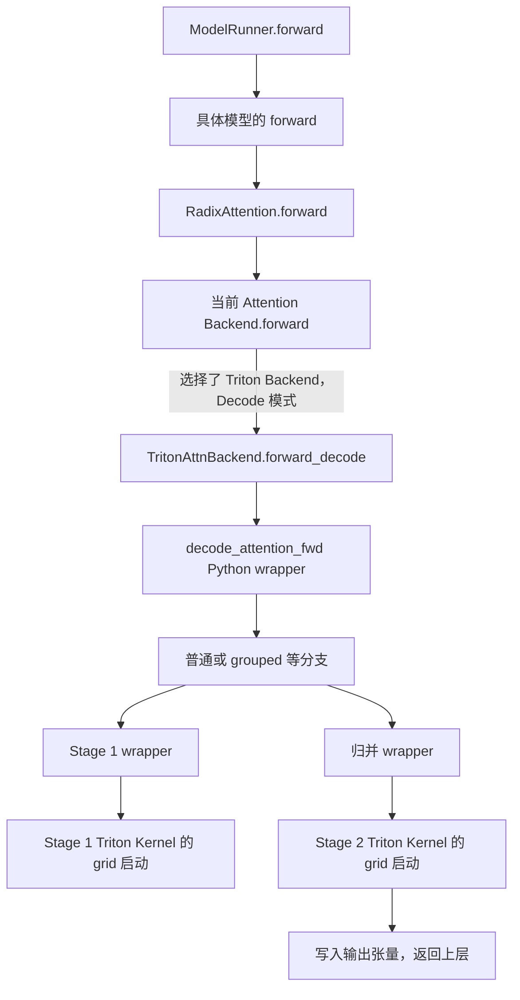

# SGLang Triton 算子调用与源码位置指南

本文基于本地仓库提交 `03d06a764e4a83268eefd1bafc676418f7269c89`，整理日期为 2026-09-09。所有相对链接从本文所在的 `study/` 目录出发。内容以当前源码为准，重点回答：**模型如何调用 Triton、Kernel 如何启动、不同算子去哪里找。**

## 1. 先分清三个层次

| 层次 | 做什么 | 典型位置 |
|---|---|---|
| 模型层 / 运行时 Backend | 根据模型、设备、执行模式准备输入并选择实现 | `srt/models/`、`srt/layers/` |
| Python 算子入口 / wrapper | 检查形状、创建输出和临时张量、计算 grid、启动一个或多个 Kernel | `kernels/ops/<类别>/` 下的普通 Python 函数 |
| Triton 设备函数 | 通过 `tl.load`、计算和 `tl.store` 实现设备侧工作 | 带 `@triton.jit` 的函数 |

通常调用的是普通 Python wrapper，它内部再执行 `kernel[grid](...)`。一个逻辑算子可能启动多个 Kernel；一个 `@triton.jit` 函数也可能只是供其他 Kernel 调用的设备辅助函数，不能把装饰器数量当作用户可调用算子的数量。

另外，`kernels/ops/` 是不同后端共用的算子命名空间，里面并非全是 Triton。看到 `jit` 也不等于看到了 Triton：本仓库还有基于 CUDA/C++ 源码即时编译的实现。

## 2. 真实调用链：模型如何进入 Triton Attention



### 2.1 Backend 的创建

[attention_registry.py](../python/sglang/srt/layers/attention/attention_registry.py) 中注册了 `"triton"`，`create_triton_backend(runner)` 创建 `TritonAttnBackend`。启动配置可用 `--attention-backend triton` 指定 Attention 后端，但能否使用还受模型和硬件约束；例如该创建函数明确拒绝 encoder-decoder 模型。

这个参数只针对 Attention 后端，不会将整个模型的 GEMM、量化、采样和所有其他算子都转换为 Triton。

### 2.2 模型层如何调用 Backend

[radix_attention.py](../python/sglang/srt/layers/radix_attention.py) 的 `RadixAttention.forward()` 在相应路径调用 `get_attn_backend().forward(...)`。文件中也包含配合编译和统一 Attention 调用的包装路径，因此并非所有运行模式都表现为同一段直接调用。

[base_attn_backend.py](../python/sglang/srt/layers/attention/base_attn_backend.py) 定义 Backend 接口与前向分派；具体 Triton 实现在 [triton_backend.py](../python/sglang/srt/layers/attention/triton_backend.py)。

### 2.3 Backend 如何进入算子 wrapper

`TritonAttnBackend.__init__()` 从 `sglang.kernels.ops.attention` 下的具体模块导入 `decode_attention_fwd`、`extend_attention_fwd` 等函数，并将相应入口用 `torch.compiler.disable(...)` 包装。

这里的 `torch.compiler.disable` 是 PyTorch 编译边界处理，不会关闭函数内部的 Triton JIT。

`forward_decode()` 准备 Q、KV buffer、输出张量及 KV 索引等，再调用 `self.decode_attention_fwd(...)`。Prefill/Extend 则进入 `forward_extend()` 及对应算子，具体还有 MLA、滑动窗口、验证等分支。

### 2.4 一个 Decode 算子内部为什么有多次启动

[decode_attention.py](../python/sglang/kernels/ops/attention/decode_attention.py) 中，普通路径可沿以下函数阅读：

```text
decode_attention_fwd
  → decode_attention_fwd_normal
    → _decode_att_m_fwd
      → _fwd_kernel_stage1[grid](...)
    → _decode_softmax_reducev_fwd
      → _fwd_kernel_stage2[grid](...)
```

Stage 1 按 KV 分片计算局部 Attention 结果及归并所需信息，Stage 2 合并分片结果并写出最终输出。Grouped 路径使用对应的 grouped Stage 1；同一文件还包含其他优化分支，不能认为所有形状都运行上述普通路径。

理解 wrapper 的参数时优先看：

| 参数 | 含义 |
|---|---|
| `q` | 当前计算位置的 Query |
| `k_buffer`、`v_buffer` | 已存储的 Key / Value |
| `kv_indptr`、`kv_indices` | 按请求索引 KV 的元数据；具体页/槽位解释取决于布局 |
| `o` | 输出张量，Kernel 向其中写结果 |
| `attn_logits`、`attn_lse` | 分片中间结果和归并相关信息，以实现中的布局为准 |
| `num_kv_splits`、`max_kv_splits` | KV 分片安排 |
| `page_size`、stride 等 | 物理地址计算所需的布局信息 |

调用方只看到一个 Attention 算子，底层实际上包含数据准备、多个 Kernel 和可能的布局转换。

## 3. `kernel[grid](...)` 到底在做什么

### 3.1 用仓库中的 KV 写入算子逐行理解

文件：[triton_store_cache.py](../python/sglang/kernels/ops/kvcache/triton_store_cache.py)。

普通 Python 入口是 `triton_fused_store_flashmla(input, cache, indices, page_size)`。它处理空输入，将缓存转换成所需 dtype 的视图，必要时把索引转成 `int32`，最后启动：

```python
# 摘录并简化；省略的参数需以源码为准，不能直接作为完整调用运行。
N = input.shape[0]
_triton_fused_store_flashmla_kernel[(N, _MLA_NUM_TILES)](
    input,
    cache_fp8,
    cache_bf16,
    cache,
    indices_i32,
    N,
    PAGE_SIZE=page_size,
    # 还有布局、tile、量化范围等参数
)
```

设备函数中：

```python
# 同样是源码片段，省略函数签名和其余计算。
token_id = tl.program_id(0)
tile_id = tl.program_id(1)
loc = tl.load(indices_ptr + token_id).to(tl.int32)
page = loc // PAGE_SIZE
slot = loc % PAGE_SIZE
```

`grid=(N, _MLA_NUM_TILES)` 定义二维 program 实例网格：第一维对应 token，第二维对应其内部 tile。这个实现的 `_MLA_NUM_TILES` 为 8，其中一部分 tile 做 FP8 量化，另一个分支复制 RoPE 部分，随后写入指定分页缓存位置。

这是面向特定模型缓存布局的融合算子，不能拿任意 KV 张量直接调用。普通 wrapper 有时不逐项验证所有形状，正确性仍依赖调用方遵守布局约定。此例用于解释 Kernel 启动语法，并不表示所有模型都会执行它。

### 3.2 关键语法速查

| 写法 | 作用 | 容易混淆的点 |
|---|---|---|
| `@triton.jit` | 将函数标记为 Triton JIT 设备代码 | 不等于定义时立即在设备上执行 |
| `kernel[grid](...)` | 按 grid 启动设备 program 实例 | `grid` 不是输入张量的 shape，也不是直接填写 CUDA 线程数 |
| `tl.program_id(axis)` | 获取当前 program 的网格坐标 | 不是张量元素索引，需要结合 tile 计算 |
| `tl.arange(0, BLOCK)` | 构造块内逻辑索引 | 元素到线程的映射由编译器布局决定 |
| `tl.load(ptr + offsets, mask=...)` | 按偏移读取数据，必要时屏蔽越界 | 稀疏或分页数据必须使用正确的间接索引 |
| `tl.store(...)` | 将结果写回设备内存 | 许多 wrapper 通过输出参数返回结果 |
| `X: tl.constexpr` | 编译期常量，可用于展开和特化 | 取值变化可能产生不同编译变体 |
| `num_warps`、`num_stages` | 启动/编译配置 | 不是越大越快，部分 Kernel 使用默认值 |
| `@triton.autotune` | 对声明的配置进行调优选择 | 不是所有 Triton Kernel 都启用了 autotune |

### 3.3 首次调用、缓存与设备执行

在需要某个编译变体时，Triton 根据目标设备、参数类型、编译期常量和特化条件等生成或加载设备代码，再执行 Kernel。可复用的后续调用可以使用已有编译缓存，不需要每次重新编译。

不要把“首次请求慢”全部归因于模型计算：权重加载、Triton 编译、autotune、内存初始化和 CUDA Graph 捕获均可能贡献启动成本。CUDA 上的 Kernel 提交通常异步执行，Python 函数返回不代表设备已经完成；计时时应使用有正确同步语义的 benchmark 工具。

## 4. 同一个算子名如何选择实现

本仓库有几种并存的入口，阅读时先判断属于哪一类：

1. **直接导入 wrapper。** 例如 `TritonAttnBackend` 导入 `decode_attention_fwd`，函数内部再决定具体 Kernel 分支。
2. **公开函数包装固定后端。** `sglang.kernels.ops.<group>` 的部分公共入口通过 `get_kernel` 获取既定实现。
3. **`BaseFusedOp` 分派。** 通过 `forward_native`、`forward_triton`、`forward_aot` 等方法实现后端切换，结合显式选择、能力与平台条件决定实际路径。

[selector.py](../python/sglang/kernels/selector.py) 的 registry 选择，与 [fused_op.py](../python/sglang/kernels/fused_op.py) 的运行时分派不是同一套规则。当前 registry 不会自动对多个后端做性能排名；多实现时需要按其选择规则显式指定后端。`BaseFusedOp` 则有自己的优先级、能力过滤与回退流程。

即使一个类实现了 `forward_triton`，也不表示所有设备、dtype 和形状都会执行它。确认实际使用情况，必须继续看能力声明、平台分支和调用参数。静态索引只证明源码存在，不证明某个模型运行时使用了它。

## 5. 算子目录地图

### 5.1 统一算子命名空间

主目录：[python/sglang/kernels/ops/](../python/sglang/kernels/ops/)。

| 子目录 | 主要用途 / 寻找什么 |
|---|---|
| `activation/` | 激活函数及与乘法等操作的融合 |
| `attention/` | Decode、Extend、稀疏/滑窗/MLA 等 Attention，及相关元数据处理 |
| `communication/` | 通信相关操作 |
| `diffusion/` | 扩散生成使用的算子 |
| `elementwise/` | 逐元素和布局相关基础操作 |
| `embeddings/` | embedding 相关操作 |
| `gemm/` | 矩阵乘法相关实现 |
| `grammar/` | 结构化生成约束相关操作 |
| `kvcache/` | KV 写入、量化、搬运、布局处理 |
| `layernorm/` | 归一化及其融合变体 |
| `lplb/` | 负载均衡相关操作 |
| `mamba/` | 状态空间模型相关更新和扫描操作 |
| `memory/` | 内存与数据移动相关操作 |
| `moe/` | 专家分发、路由、融合 MoE 计算 |
| `quantization/` | FP8/低比特量化、反量化及相关矩阵运算 |
| `sampling/` | 采样相关操作 |
| `speculative/` | 推测解码所需索引、状态和验证辅助操作 |
| `kv_canary/` | KV 正确性检查相关辅助操作 |
| `kimi_k3/`、`minicpm_sala/` | 模型专用操作 |
| `mm/` | 多模态相关操作 |

这些是算子类别，**不是“每个目录一定有 Triton”的保证**。具体哪些文件包含 Triton 定义，见本文附录的扫描结果。

### 5.2 统一目录之外也要找

| 目录 | 为什么值得检查 |
|---|---|
| `python/sglang/srt/layers/` | Attention 专用实现、MoE、线性 Attention 等仍可能含设备函数 |
| `python/sglang/srt/lora/` | LoRA Backend 与相关专用路径 |
| `python/sglang/srt/mem_cache/` | 缓存索引、分配、状态操作中的辅助 Kernel |
| `python/sglang/srt/speculative/` | 推测解码数据处理 |
| `python/sglang/srt/batch_invariant_ops/` | 对批次变化具有特定数值行为要求的实现 |
| `python/sglang/srt/hardware_backend/` | 特定设备适配；不能默认都是 CUDA Triton |
| `python/sglang/multimodal_gen/` | 独立多模态生成运行时中的算子 |
| `python/sglang/kernels/kda_kernels/` | 专用 KDA 实现 |

附录按实际文件位置分组，可避免仅搜索名称含 `triton` 的文件而漏掉 `decode_attention.py` 等实现。

### 5.3 不要混淆 Triton、CUDA JIT 和 AOT

| 实现类型 | 如何辨认 | 源码入口示例 |
|---|---|---|
| Triton | `import triton.language as tl`、`@triton.jit`、`kernel[grid](...)` | `ops/attention/decode_attention.py` |
| CUDA JIT | `load_jit(...)`、`cuda_files`、`.cuh/.cu`、FFI module 调用 | `ops/layernorm/rmsnorm_hf.py` → `jit/include/` 等构建资源 |
| AOT 扩展 | 调用预编译扩展导出的函数 | `kernels/aot/`、Python 包 `sgl_kernel` |
| 其他 DSL/第三方后端 | CuTe DSL、FlashInfer、DeepGEMM 等各自入口 | 分布于公共算子和后端适配目录 |

例如 `rmsnorm_hf.py` 虽然有 `@cache_once` 和 `_jit_rmsnorm_hf_module`，实际调用的是 `load_jit(..., cuda_files=["elementwise/rmsnorm_hf.cuh"], ...)`，不是 Triton Kernel。应该看实现和 import，不能根据 RMSNorm 或 JIT 的名称猜后端。

## 6. 如何从一个算子反查调用者

在仓库根目录使用以下命令。示例命令适用于当前 PowerShell 环境，也没有依赖运行 SGLang。

```powershell
# 找 Triton 定义文件：比只按文件名搜索 triton 更完整。
rg -l '@triton\.jit' python/sglang

# 找 decode_attention_fwd 的定义、导入和调用。
rg -n 'decode_attention_fwd' python/sglang

# 在实现内看 wrapper、设备函数、启动点。
rg -n '^def |@triton\.jit|\[grid\]' python/sglang/kernels/ops/attention/decode_attention.py

# 查看 Backend 如何保存和调用函数引用。
rg -n 'self\.decode_attention_fwd|def forward_decode' python/sglang/srt/layers/attention/triton_backend.py

# 找单元测试和基准；测试可能分散在不同目录。
rg -n 'decode_attention_fwd|triton_fused_store_flashmla' test benchmark python/sglang/multimodal_gen/test

# 找自动调优配置。
rg -n '@triton\.autotune|triton\.Config' python/sglang/kernels/ops
```

如果搜索到了 `self.xxx(...)`，应先找到 `self.xxx = ...`；如果搜到别名 import，要沿别名继续查。如果调用通过 registry 或 `BaseFusedOp` 完成，还要追踪注册条目和后端选择。

推荐先看 wrapper 的 shape/dtype/stride 约定，再读 Kernel 的指针地址计算，最后读调优参数。这样更容易知道每个 `tl.load` 究竟在读哪块数据。

## 7. 修改或新增 Triton 算子时如何接入

按当前 [Kernel 命名空间说明](../python/sglang/kernels/README.md)，运行时代码应优先从 `sglang.kernels.ops.*` 导入可调用算子。

一般步骤如下：

1. 在对应 `ops/<group>/` 中放置实现，提供清晰的普通 Python wrapper。
2. 明确输入输出形状、dtype、stride、是否要求连续内存、是否原地修改，以及支持的设备。
3. 在 wrapper 中准备输出和临时缓冲区，处理空输入及合法边界，配置 grid 并启动 Kernel。
4. 按该类现有风格接到 Backend、公共入口或 `BaseFusedOp`，确保不能使用优化实现时有合理的处理路径。
5. 用参考实现验证数值结果，覆盖非整块长度、边界形状、布局和 dtype；再测稳定状态性能与首次编译成本。

不要把独立 microbenchmark 的加速比直接当成模型端到端收益。算子可能只占很小比例，也可能增加中间转换、同步或临时内存分配。需要同时验证其在目标模型中的实际调用频率与整体延迟。

本次仅做静态源码梳理，没有启动模型、运行 GPU Kernel 或做性能测试。

## 8. 全量源码索引：包含 `@triton.jit` 的文件和函数

以下索引由本次对 `python/sglang/**/*.py` 的静态扫描生成。扫描标准是 AST 装饰器中的 `triton.jit`，包含顶层及嵌套函数；不会导入模块或触发编译。

范围限制：这是**当前仓库扫描范围内的 Triton 定义索引**，包括设备辅助函数；不包含仅调用外部 Triton 包的文件，也不把 `torch.compile` 生成的代码、别名形式装饰器、其他 Triton DSL 或仓库范围外的依赖算作已枚举实现。某些文件自身是测试或工具，不一定属于服务热路径。文件链接稳定于当前目录，函数名可用于编辑器搜索。

本次共识别 **267 个文件、704 个带 triton.jit 装饰器的函数定义**。这是静态定义数量，不是独立算子数量或运行次数。

| 分类目录 | 文件数 | JIT 函数定义数 |
|---|---:|---:|
| `python/sglang/kernels/aot/` | 4 | 10 |
| `python/sglang/kernels/kda_kernels/` | 3 | 12 |
| `python/sglang/kernels/ops/activation/` | 1 | 2 |
| `python/sglang/kernels/ops/attention/` | 81 | 211 |
| `python/sglang/kernels/ops/diffusion/` | 29 | 58 |
| `python/sglang/kernels/ops/elementwise/` | 1 | 6 |
| `python/sglang/kernels/ops/embeddings/` | 1 | 1 |
| `python/sglang/kernels/ops/gemm/` | 17 | 23 |
| `python/sglang/kernels/ops/grammar/` | 2 | 3 |
| `python/sglang/kernels/ops/kimi_k3/` | 1 | 1 |
| `python/sglang/kernels/ops/kv_canary/` | 3 | 7 |
| `python/sglang/kernels/ops/kvcache/` | 12 | 31 |
| `python/sglang/kernels/ops/layernorm/` | 5 | 14 |
| `python/sglang/kernels/ops/mamba/` | 9 | 21 |
| `python/sglang/kernels/ops/memory/` | 5 | 14 |
| `python/sglang/kernels/ops/mm/` | 1 | 1 |
| `python/sglang/kernels/ops/moe/` | 22 | 86 |
| `python/sglang/kernels/ops/quantization/` | 7 | 24 |
| `python/sglang/kernels/ops/（根目录文件）` | 1 | 4 |
| `python/sglang/kernels/ops/sampling/` | 3 | 8 |
| `python/sglang/kernels/ops/speculative/` | 16 | 54 |
| `python/sglang/multimodal_gen/runtime/` | 2 | 6 |
| `python/sglang/srt/batch_invariant_ops/` | 1 | 6 |
| `python/sglang/srt/disaggregation/` | 1 | 2 |
| `python/sglang/srt/distributed/` | 1 | 12 |
| `python/sglang/srt/hardware_backend/` | 3 | 5 |
| `python/sglang/srt/layers/` | 14 | 45 |
| `python/sglang/srt/lora/` | 5 | 8 |
| `python/sglang/srt/mem_cache/` | 3 | 4 |
| `python/sglang/srt/models/` | 9 | 18 |
| `python/sglang/srt/speculative/` | 2 | 5 |
| `python/sglang/srt/utils/` | 1 | 1 |
| `python/sglang/test/` | 1 | 1 |

### `python/sglang/kernels/aot/`

| 源文件 | Triton 函数名 |
|---|---|
| [benchmark/bench_moe_align_block_size.py](../python/sglang/kernels/aot/benchmark/bench_moe_align_block_size.py) | `moe_align_block_size_stage1`<br>`moe_align_block_size_stage2`<br>`moe_align_block_size_stage3`<br>`moe_align_block_size_stage4` |
| [benchmark/bench_sum_scale.py](../python/sglang/kernels/aot/benchmark/bench_sum_scale.py) | `_moe_sum_reduce_kernel` |
| [tests/test_merge_state_v2.py](../python/sglang/kernels/aot/tests/test_merge_state_v2.py) | `merge_state_kernel` |
| [tests/test_moe_align.py](../python/sglang/kernels/aot/tests/test_moe_align.py) | `moe_align_block_size_stage1`<br>`moe_align_block_size_stage2`<br>`moe_align_block_size_stage3`<br>`moe_align_block_size_stage4` |

### `python/sglang/kernels/kda_kernels/`

| 源文件 | Triton 函数名 |
|---|---|
| [flux2_token_cat_fp8_triton.py](../python/sglang/kernels/kda_kernels/flux2_token_cat_fp8_triton.py) | `_token_cat_fp8_kernel` |
| [layernorm_modulate_triton.py](../python/sglang/kernels/kda_kernels/layernorm_modulate_triton.py) | `_rcp4`<br>`_welford_push`<br>`_welford_combine`<br>`_split_halves`<br>`_fold_halves`<br>`_fold_tree_32`<br>`_push_vec4`<br>`_layernorm_modulate_kernel`<br>`_qk_ln_head_one`<br>`_qk_ln_head_kernel` |
| [qwen38_qsa_sm121/kernel.py](../python/sglang/kernels/kda_kernels/qwen38_qsa_sm121/kernel.py) | `_qsa_split_kernel` |

### `python/sglang/kernels/ops/activation/`

| 源文件 | Triton 函数名 |
|---|---|
| [softcap.py](../python/sglang/kernels/ops/activation/softcap.py) | `softcap_out_kernel`<br>`softcap_inplace_logits_kernel` |

### `python/sglang/kernels/ops/attention/`

| 源文件 | Triton 函数名 |
|---|---|
| [dcp_kernels.py](../python/sglang/kernels/ops/attention/dcp_kernels.py) | `create_triton_kv_indices_for_dcp_triton`<br>`create_mla_kv_page_table_for_dcp`<br>`create_dcp_kv_indices`<br>`update_kv_lens_and_indices`<br>`_correct_attn_cp_out_kernel`<br>`_dcp_pack_a2a_send_kernel`<br>`_dcp_lse_combine_kernel` |
| [decode_attention.py](../python/sglang/kernels/ops/attention/decode_attention.py) | `tanh`<br>`_fwd_kernel_stage1`<br>`_fwd_grouped_kernel_stage1`<br>`_fwd_kernel_stage2`<br>`remap_xcd`<br>`cal_num_split_wgs`<br>`_lean_attention_decode_kernel` |
| [deepseek_v4_rope.py](../python/sglang/kernels/ops/attention/deepseek_v4_rope.py) | `apply_rotary_emb_triton_kernel`<br>`apply_rotary_emb_triton_kernel_batched`<br>`apply_rotary_emb_flat_kernel`<br>`_fused_norm_rope_kernel`<br>`_fused_softmax_pool_kernel` |
| [dsa/cp_split.py](../python/sglang/kernels/ops/attention/dsa/cp_split.py) | `dsa_cp_interleave_q_seqs_kernel` |
| [dsa/dequant_k_cache.py](../python/sglang/kernels/ops/attention/dsa/dequant_k_cache.py) | `_dequantize_k_cache_fast_kernel`<br>`_dequantize_k_cache_paged_kernel`<br>`_gather_dequant_requant_fp8_paged_vec_kernel`<br>`_gather_dequant_requant_fp8_paged_kernel`<br>`_concat_cast_kv_fp8_pad_kernel` |
| [dsa/index_buf_accessor.py](../python/sglang/kernels/ops/attention/dsa/index_buf_accessor.py) | `_set_k_and_s_triton_kernel`<br>`_get_k_triton_kernel`<br>`_get_s_triton_kernel`<br>`_get_k_and_s_triton_kernel` |
| [dsa/quant_k_cache.py](../python/sglang/kernels/ops/attention/dsa/quant_k_cache.py) | `_gather_dsa_kv_scales`<br>`_quantize_k_cache_fast_kernel` |
| [dsa/transform_index.py](../python/sglang/kernels/ops/attention/dsa/transform_index.py) | `prepare_trtllm_nope_sparse_metadata_kernel`<br>`transform_index_page_table_decode_kernel`<br>`transform_index_page_table_prefill_kernel` |
| [dsa/triton_kernel.py](../python/sglang/kernels/ops/attention/dsa/triton_kernel.py) | `_act_quant_kernel`<br>`_get_valid_kv_indices_kernel` |
| [dsa/triton_sparse_mla.py](../python/sglang/kernels/ops/attention/dsa/triton_sparse_mla.py) | `_sparse_mla_fwd_kernel` |
| [dsa_metadata.py](../python/sglang/kernels/ops/attention/dsa_metadata.py) | `_fused_dsa_decode_metadata_kernel`<br>`_fused_dsa_target_verify_metadata_kernel`<br>`_fused_dsa_draft_extend_metadata_kernel` |
| [dsv4/attn.py](../python/sglang/kernels/ops/attention/dsv4/attn.py) | `create_paged_compress_data_kernel` |
| [dsv4/c128_cleanup.py](../python/sglang/kernels/ops/attention/dsv4/c128_cleanup.py) | `_clear_unaccepted_c128_draft_states_kernel` |
| [dsv4/dequant_k_cache.py](../python/sglang/kernels/ops/attention/dsv4/dequant_k_cache.py) | `_dequantize_k_cache_paged_kernel`<br>`_gather_dequant_requant_fp8_paged_kernel` |
| [dsv4/fp4_indexer.py](../python/sglang/kernels/ops/attention/dsv4/fp4_indexer.py) | `_select_group_value`<br>`_ceil_ue8m0_exp`<br>`_fp4_e2m1_code`<br>`_quantize_fp4_indexer_kernel`<br>`_store_fp4_index_k_cache_kernel` |
| [dsv4/fp4_indexer_schedule_hip.py](../python/sglang/kernels/ops/attention/dsv4/fp4_indexer_schedule_hip.py) | `_pad_page_table_tile`<br>`_prefill_schedule_prep_kernel`<br>`_pad_page_table_kernel` |
| [dsv4/fused_compress_triton.py](../python/sglang/kernels/ops/attention/dsv4/fused_compress_triton.py) | `_fused_ape_pool_norm_rope_kernel`<br>`_c4_decode_kernel`<br>`_c4_prefill_compress_kernel`<br>`_c4_prefill_write_kernel`<br>`_c128_decode_kernel`<br>`_c128_prefill_compress_kernel`<br>`_c128_prefill_write_kernel`<br>`_compress_norm_rope_kernel`<br>`_compress_norm_rope_hadamard_kernel` |
| [dsv4/index_buf_accessor.py](../python/sglang/kernels/ops/attention/dsv4/index_buf_accessor.py) | `_set_k_and_s_triton_kernel` |
| [dsv4/metadata_kernel.py](../python/sglang/kernels/ops/attention/dsv4/metadata_kernel.py) | `_init_compressed_attn_metadata_kernel` |
| [dsv4/quant_k_cache.py](../python/sglang/kernels/ops/attention/dsv4/quant_k_cache.py) | `_quant_k_cache_fused_kernel` |
| [dsv4/rms_normalize_hip.py](../python/sglang/kernels/ops/attention/dsv4/rms_normalize_hip.py) | `_rms_normalize_kernel` |
| [dsv4/sparse_prefill_kernels.py](../python/sglang/kernels/ops/attention/dsv4/sparse_prefill_kernels.py) | `_build_swa_token_ids_kernel`<br>`_combine_topk_swa_indices_kernel` |
| [dsv4/unified_kv_kernels/paged_decode.py](../python/sglang/kernels/ops/attention/dsv4/unified_kv_kernels/paged_decode.py) | `_paged_decode_fused_kernel`<br>`_paged_decode_split_kernel`<br>`_paged_decode_reduce_kernel` |
| [dsv4/unified_kv_kernels/paged_decode_indices.py](../python/sglang/kernels/ops/attention/dsv4/unified_kv_kernels/paged_decode_indices.py) | `_v4_paged_decode_indices_kernel` |
| [dsv4/unified_kv_kernels/paged_prefill.py](../python/sglang/kernels/ops/attention/dsv4/unified_kv_kernels/paged_prefill.py) | `_sparse_attn_v4_paged_prefill_kernel` |
| [dsv4/unified_kv_kernels/runtime.py](../python/sglang/kernels/ops/attention/dsv4/unified_kv_kernels/runtime.py) | `_swa_scatter_kernel`<br>`_scatter_loc_kernel`<br>`_fill_compress_tail_kernel`<br>`_prefill_lengths_kernel`<br>`_build_prefill_indices_kernel` |
| [dsv4_attn_metadata_kernels.py](../python/sglang/kernels/ops/attention/dsv4_attn_metadata_kernels.py) | `_expand_prefill_causally_kernel`<br>`_page_table_positions_kernel`<br>`_causal_swa_page_indices_kernel` |
| [extend_attention.py](../python/sglang/kernels/ops/attention/extend_attention.py) | `tanh`<br>`_copy_unified_indices_kernel`<br>`_fwd_kernel`<br>`_fwd_kernel_unified`<br>`_dense_prefill_inner`<br>`_fwd_kernel_dense_prefill` |
| [fla/chunk_delta_h.py](../python/sglang/kernels/ops/attention/fla/chunk_delta_h.py) | `chunk_gated_delta_rule_fwd_kernel_h_blockdim64` |
| [fla/chunk_fwd.py](../python/sglang/kernels/ops/attention/fla/chunk_fwd.py) | `chunk_gated_delta_rule_fwd_kkt_solve_kernel` |
| [fla/chunk_intra.py](../python/sglang/kernels/ops/attention/fla/chunk_intra.py) | `chunk_kda_fwd_kernel_inter_solve_fused`<br>`chunk_kda_fwd_kernel_intra_sub_chunk` |
| [fla/chunk_intra_token_parallel.py](../python/sglang/kernels/ops/attention/fla/chunk_intra_token_parallel.py) | `chunk_kda_fwd_kernel_intra_token_parallel` |
| [fla/chunk_o.py](../python/sglang/kernels/ops/attention/fla/chunk_o.py) | `chunk_fwd_kernel_o` |
| [fla/cumsum.py](../python/sglang/kernels/ops/attention/fla/cumsum.py) | `chunk_local_cumsum_scalar_kernel`<br>`chunk_local_cumsum_vector_kernel` |
| [fla/fused_gdn_gating.py](../python/sglang/kernels/ops/attention/fla/fused_gdn_gating.py) | `fused_gdn_gating_kernel` |
| [fla/fused_kda_conv_recurrent_verify.py](../python/sglang/kernels/ops/attention/fla/fused_kda_conv_recurrent_verify.py) | `fused_kda_conv_gating_verify_kernel` |
| [fla/fused_norm_gate.py](../python/sglang/kernels/ops/attention/fla/fused_norm_gate.py) | `layer_norm_gated_fwd_kernel`<br>`layer_norm_gated_fwd_kernel1` |
| [fla/fused_recurrent.py](../python/sglang/kernels/ops/attention/fla/fused_recurrent.py) | `fused_recurrent_gated_delta_rule_fwd_kernel`<br>`fused_recurrent_gated_delta_rule_packed_decode_kernel`<br>`fused_recurrent_kda_packed_decode_kernel`<br>`fused_recurrent_gated_delta_rule_update_fwd_kernel` |
| [fla/fused_recurrent_linear_replayssm.py](../python/sglang/kernels/ops/attention/fla/fused_recurrent_linear_replayssm.py) | `fused_recurrent_linear_replayssm_decode_kernel` |
| [fla/fused_sigmoid_gating_recurrent.py](../python/sglang/kernels/ops/attention/fla/fused_sigmoid_gating_recurrent.py) | `fused_sigmoid_gating_delta_rule_update_kernel` |
| [fla/gdn_replayssm_spec_decode.py](../python/sglang/kernels/ops/attention/fla/gdn_replayssm_spec_decode.py) | `gdn_replayssm_spec_circular_kernel`<br>`gdn_replayssm_exact_fold_kernel`<br>`gdn_replayssm_circular_commit_kernel`<br>`gdn_replayssm_compact_commit_kernel`<br>`_finish_gdn_replayssm_circular_fold_kernel`<br>`_advance_gdn_spec_cursors_kernel`<br>`_reset_gdn_replayssm_spec_cursors_kernel` |
| [fla/gdn_replayssm_spec_fold.py](../python/sglang/kernels/ops/attention/fla/gdn_replayssm_spec_fold.py) | `gdn_replayssm_exact_fold_kernel` |
| [fla/kda.py](../python/sglang/kernels/ops/attention/fla/kda.py) | `chunk_kda_scaled_dot_kkt_fwd_kernel_intra_sub_inter`<br>`chunk_kda_scaled_dot_kkt_fwd_kernel_intra_sub_intra`<br>`_recompute_w_u_fwd_kernel`<br>`chunk_gla_fwd_kernel_o`<br>`softplus_fwd`<br>`kda_gate_chunk_cumsum_vector_kernel` |
| [fla/kda_replayssm_spec_decode.py](../python/sglang/kernels/ops/attention/fla/kda_replayssm_spec_decode.py) | `kda_replayssm_exact_fold_kernel` |
| [fla/l2norm.py](../python/sglang/kernels/ops/attention/fla/l2norm.py) | `l2norm_fwd_kernel1`<br>`l2norm_fwd_kernel`<br>`gdn_prefill_qkv_prepare_kernel` |
| [fla/layernorm_gated.py](../python/sglang/kernels/ops/attention/fla/layernorm_gated.py) | `_layer_norm_fwd_1pass_kernel` |
| [fla/op.py](../python/sglang/kernels/ops/attention/fla/op.py) | `safe_exp`<br>`gather`<br>`make_tensor_descriptor` |
| [fla/wy_fast.py](../python/sglang/kernels/ops/attention/fla/wy_fast.py) | `recompute_w_u_fwd_kernel` |
| [flash_mla_sm120.py](../python/sglang/kernels/ops/attention/flash_mla_sm120.py) | `_page_split_kernel`<br>`_page_mark_kernel` |
| [flash_mla_sm120_triton.py](../python/sglang/kernels/ops/attention/flash_mla_sm120_triton.py) | `_tiled_sparse_decode_kernel` |
| [fused_qk_norm_rope_store.py](../python/sglang/kernels/ops/attention/fused_qk_norm_rope_store.py) | `_batched_rmsnorm`<br>`_gptj_rotate`<br>`_batched_rope`<br>`_fused_qk_norm_rope_store_kernel` |
| [fused_qk_rmsnorm_rope_gate.py](../python/sglang/kernels/ops/attention/fused_qk_rmsnorm_rope_gate.py) | `_fused_qk_rmsnorm_rope_gate_kernel` |
| [linear/kda_blackwell/prologue.py](../python/sglang/kernels/ops/attention/linear/kda_blackwell/prologue.py) | `_kda_prologue_kernel` |
| [linear/lightning_attn.py](../python/sglang/kernels/ops/attention/linear/lightning_attn.py) | `_fwd_diag_kernel`<br>`_fwd_kv_parallel`<br>`_fwd_kv_reduce`<br>`_fwd_none_diag_kernel`<br>`_linear_attn_decode_kernel` |
| [linear/seg_la.py](../python/sglang/kernels/ops/attention/linear/seg_la.py) | `seg_la_kernel`<br>`seg_la_p_kernel`<br>`seg_la_s_kernel`<br>`seg_la_d_kernel`<br>`seg_la_mtp_kernel`<br>`seg_la_sum_kernel` |
| [log_scaling_tau.py](../python/sglang/kernels/ops/attention/log_scaling_tau.py) | `_apply_log_scaling_tau_kernel` |
| [merge_state.py](../python/sglang/kernels/ops/attention/merge_state.py) | `merge_state_kernel` |
| [metadata.py](../python/sglang/kernels/ops/attention/metadata.py) | `get_num_kv_splits_triton`<br>`_prepare_swa_spec_page_table_kernel`<br>`_fused_metadata_kernel_general`<br>`_fused_metadata_kernel_ps1_no_swa`<br>`_draft_extend_metadata_kernel` |
| [minimax_m3_qk_norm_rope.py](../python/sglang/kernels/ops/attention/minimax_m3_qk_norm_rope.py) | `_qk_gemma_rmsnorm_rope_kernel`<br>`_sparse_qk_index_gemma_rmsnorm_rope_kernel`<br>`_sparse_qk_index_gemma_rmsnorm_rope_cache_kernel` |
| [minimax_sparse/common/utils.py](../python/sglang/kernels/ops/attention/minimax_sparse/common/utils.py) | `_compare_and_swap`<br>`_bitonic_merge`<br>`_sort_ids_ascending` |
| [minimax_sparse/decode/flash_with_topk_idx.py](../python/sglang/kernels/ops/attention/minimax_sparse/decode/flash_with_topk_idx.py) | `_decode_score_kernel`<br>`_decode_score_attn_kernel`<br>`_merge_attn_out_kernel`<br>`_topk_index_partial_kernel`<br>`_topk_index_merge_kernel` |
| [minimax_sparse/decode/topk_sparse.py](../python/sglang/kernels/ops/attention/minimax_sparse/decode/topk_sparse.py) | `_gqa_share_sparse_decode_kernel`<br>`_merge_topk_attn_out_kernel` |
| [minimax_sparse/prefill/flash_with_topk_idx.py](../python/sglang/kernels/ops/attention/minimax_sparse/prefill/flash_with_topk_idx.py) | `_flash_attn_fwd_with_block_score_kernel`<br>`_topk_index_kernel` |
| [minimax_sparse/prefill/topk_sparse.py](../python/sglang/kernels/ops/attention/minimax_sparse/prefill/topk_sparse.py) | `_gqa_share_sparse_fwd_kernel` |
| [mla_kv_pack_quantize_fp8.py](../python/sglang/kernels/ops/attention/mla_kv_pack_quantize_fp8.py) | `_v0_kernel`<br>`_v1_flat_kernel` |
| [mrope.py](../python/sglang/kernels/ops/attention/mrope.py) | `apply_interleaved_rope_kernel` |
| [nsa_triton_decode/triton_mla_kernels_decode_fused.py](../python/sglang/kernels/ops/attention/nsa_triton_decode/triton_mla_kernels_decode_fused.py) | `_process_kv_block_aggressive`<br>`_fused_gather_attn_dsv4_kernel`<br>`_fused_gather_attn_dsv4_dual_scope_kernel`<br>`_fused_gather_attn_dsv4_dual_scope_splitk_kernel`<br>`_fused_gather_attn_dsv4_splitk_kernel`<br>`_combine_splitk_kernel`<br>`_combine_splitk_kernel_8_optimized`<br>`_combine_splitk_kernel_2` |
| [pa_page_table.py](../python/sglang/kernels/ops/attention/pa_page_table.py) | `_build_pa_page_table_kernel` |
| [pad.py](../python/sglang/kernels/ops/attention/pad.py) | `pad_sequence_with_mask_kernel`<br>`pad_draft_extend_query_kernel`<br>`unpad_draft_extend_output_kernel`<br>`seqlens_expand_kernel` |
| [position.py](../python/sglang/kernels/ops/attention/position.py) | `compute_position_kernel` |
| [prefill_attention.py](../python/sglang/kernels/ops/attention/prefill_attention.py) | `_fwd_kernel` |
| [rocm_mla_decode_rope.py](../python/sglang/kernels/ops/attention/rocm_mla_decode_rope.py) | `tanh`<br>`_fwd_grouped_kernel_stage1_rope` |
| [rotary_triton.py](../python/sglang/kernels/ops/attention/rotary_triton.py) | `_triton_mrope_forward_fused`<br>`_triton_ernie45_rope_qk_fused` |
| [score_mod.py](../python/sglang/kernels/ops/attention/score_mod.py) | `relative_bias_score_mod` |
| [suffix_attention_merge.py](../python/sglang/kernels/ops/attention/suffix_attention_merge.py) | `_fused_suffix_attention_merge_kernel` |
| [triton_gdn_fused_proj.py](../python/sglang/kernels/ops/attention/triton_gdn_fused_proj.py) | `fused_qkvzba_split_reshape_cat_kernel`<br>`fused_qkvzba_split_reshape_cat_contiguous_kernel`<br>`_fused_qkvzba_causal_conv1d_update_contiguous_kernel`<br>`fused_qkv_split_gdn_prefill_kernel` |
| [unified_attention_3d_mtp.py](../python/sglang/kernels/ops/attention/unified_attention_3d_mtp.py) | `cdiv_fn`<br>`apply_softcap`<br>`find_seq_idx`<br>`unified_attention_3d_mtp_kernel`<br>`unified_attention_3d_mtp_reduce_segments_kernel` |
| [utils.py](../python/sglang/kernels/ops/attention/utils.py) | `reshape_and_cache_shuffle_5d`<br>`gather_shuffle_5d_to_linear` |
| [verify_mla.py](../python/sglang/kernels/ops/attention/verify_mla.py) | `_active_splits`<br>`_verify_mla_prefix_stage1`<br>`_verify_mla_combine_stage2` |
| [verify_splitkv.py](../python/sglang/kernels/ops/attention/verify_splitkv.py) | `_verify_prefix_stage1`<br>`_verify_combine_stage2` |
| [vision_rope.py](../python/sglang/kernels/ops/attention/vision_rope.py) | `_fused_qk_complex_rope_kernel` |

### `python/sglang/kernels/ops/diffusion/`

| 源文件 | Triton 函数名 |
|---|---|
| [activation/sana_conv_post_triton.py](../python/sglang/kernels/ops/diffusion/activation/sana_conv_post_triton.py) | `_bias_silu_kernel`<br>`_bias_glu_kernel` |
| [activation/silu_mul_bitexact.py](../python/sglang/kernels/ops/diffusion/activation/silu_mul_bitexact.py) | `_silu_mul_kernel`<br>`_packed_silu_mul_kernel` |
| [attention/sana_wm_gdn_chunkwise_triton.py](../python/sglang/kernels/ops/diffusion/attention/sana_wm_gdn_chunkwise_triton.py) | `_phase_a_kv_kernel`<br>`_phase_a_z_kernel`<br>`_phase_b_kernel`<br>`_phase_b_dtile_kernel`<br>`_phase_c_kernel` |
| [attention/sana_wm_gdn_triton.py](../python/sglang/kernels/ops/diffusion/attention/sana_wm_gdn_triton.py) | `_fused_qk_inv_rms_kernel` |
| [attention/sparse_linear_attn_triton.py](../python/sglang/kernels/ops/diffusion/attention/sparse_linear_attn_triton.py) | `compress_kernel`<br>`_attn_fwd` |
| [common/numerics.py](../python/sglang/kernels/ops/diffusion/common/numerics.py) | `round_bf16_to_fp32`<br>`mul_rn_f32`<br>`div_rn_f32`<br>`rsqrt_approx_f32`<br>`cuda_rsqrtf` |
| [layout/causal_conv3d_cat_pad_triton.py](../python/sglang/kernels/ops/diffusion/layout/causal_conv3d_cat_pad_triton.py) | `_fused_cat_pad_5d_kernel` |
| [layout/nearest_upsample_nhwc_triton.py](../python/sglang/kernels/ops/diffusion/layout/nearest_upsample_nhwc_triton.py) | `_nearest_upsample_nhwc_kernel` |
| [layout/ulysses_qkv_triton.py](../python/sglang/kernels/ops/diffusion/layout/ulysses_qkv_triton.py) | `_pack_qkv_destination_major_kernel` |
| [layout/varlen_pack_pad_triton.py](../python/sglang/kernels/ops/diffusion/layout/varlen_pack_pad_triton.py) | `_fused_pack_qkv_kernel`<br>`_fused_pack_segmented_qkv_kernel`<br>`_fused_scatter_to_padded_kernel` |
| [layout/wan_causal_cache_triton.py](../python/sglang/kernels/ops/diffusion/layout/wan_causal_cache_triton.py) | `_cat_pad_cl3d_kernel`<br>`_dup_up3d_add_kernel` |
| [modulate/indexed_modulation_triton.py](../python/sglang/kernels/ops/diffusion/modulate/indexed_modulation_triton.py) | `_indexed_scale_shift_bf16_kernel`<br>`_indexed_gate_bf16_kernel` |
| [modulate/ltx2_ada_values_triton.py](../python/sglang/kernels/ops/diffusion/modulate/ltx2_ada_values_triton.py) | `_ltx2_ada_values9_kernel` |
| [modulate/scale_shift_triton.py](../python/sglang/kernels/ops/diffusion/modulate/scale_shift_triton.py) | `_fused_scaled_residual_add_exact_kernel`<br>`_fused_layernorm_scale_shift_gate_select01_kernel`<br>`_fused_residual_layernorm_scale_shift_gate_select01_kernel`<br>`_fused_scale_shift_4d_kernel`<br>`fuse_scale_shift_kernel_blc_opt` |
| [modulate/wan_temb_table_slices_triton.py](../python/sglang/kernels/ops/diffusion/modulate/wan_temb_table_slices_triton.py) | `_temb_table_slices_kernel` |
| [norm/group_norm_silu_triton.py](../python/sglang/kernels/ops/diffusion/norm/group_norm_silu_triton.py) | `_group_norm_silu_contiguous_kernel`<br>`_group_norm_stats_kernel`<br>`_group_norm_finalize_stats_kernel`<br>`_group_norm_apply_kernel`<br>`_group_norm_apply_scalar_affine_kernel` |
| [norm/group_norm_silu_twopass_triton.py](../python/sglang/kernels/ops/diffusion/norm/group_norm_silu_twopass_triton.py) | `_gn_partial_rows_kernel`<br>`_gn_finalize_kernel`<br>`_gn_apply_rows_kernel` |
| [norm/native_bf16_rmsnorm_triton.py](../python/sglang/kernels/ops/diffusion/norm/native_bf16_rmsnorm_triton.py) | `_tanh`<br>`_rmsnorm_scale_kernel`<br>`_rmsnorm_tanh_residual_kernel` |
| [norm/norm_triton.py](../python/sglang/kernels/ops/diffusion/norm/norm_triton.py) | `_layer_norm_fwd_1pass_kernel`<br>`_norm_infer_kernel` |
| [norm/rmsnorm_onepass_triton.py](../python/sglang/kernels/ops/diffusion/norm/rmsnorm_onepass_triton.py) | `_rms_norm_tiled_onepass` |
| [norm/rmsnorm_scale_shift_bitexact.py](../python/sglang/kernels/ops/diffusion/norm/rmsnorm_scale_shift_bitexact.py) | `_fold_adjacent`<br>`_rmsnorm_scale_shift_kernel` |
| [norm/rmsnorm_scale_shift_triton.py](../python/sglang/kernels/ops/diffusion/norm/rmsnorm_scale_shift_triton.py) | `_rmsnorm_scale_shift_kernel` |
| [norm/wan_rmsnorm_silu_triton.py](../python/sglang/kernels/ops/diffusion/norm/wan_rmsnorm_silu_triton.py) | `_wan_rmsnorm_silu_kernel` |
| [norm/zimage_qk_rmsnorm_triton.py](../python/sglang/kernels/ops/diffusion/norm/zimage_qk_rmsnorm_triton.py) | `_qk_rmsnorm_native_kernel` |
| [rope/hunyuan_qkv_pack_triton.py](../python/sglang/kernels/ops/diffusion/rope/hunyuan_qkv_pack_triton.py) | `_hunyuan_qkv_rope_pack_kernel` |
| [rope/ltx2_rotary_triton.py](../python/sglang/kernels/ops/diffusion/rope/ltx2_rotary_triton.py) | `_ltx2_split_rotary_kernel` |
| [rope/rope_rotate_half_bitexact.py](../python/sglang/kernels/ops/diffusion/rope/rope_rotate_half_bitexact.py) | `_rope_rotate_half_kernel` |
| [rope/rotary_triton.py](../python/sglang/kernels/ops/diffusion/rope/rotary_triton.py) | `_rotary_embedding_kernel` |
| [routing/group_limited_topk_triton.py](../python/sglang/kernels/ops/diffusion/routing/group_limited_topk_triton.py) | `_group_limited_topk_kernel` |

### `python/sglang/kernels/ops/elementwise/`

| 源文件 | Triton 函数名 |
|---|---|
| [elementwise.py](../python/sglang/kernels/ops/elementwise/elementwise.py) | `fused_dual_residual_rmsnorm_kernel`<br>`fused_rmsnorm_kernel`<br>`gelu_and_mul_kernel`<br>`silu_and_mul_kernel`<br>`_fused_sigmoid_mul_kernel`<br>`_fused_gate_sigmoid_mul_add_kernel` |

### `python/sglang/kernels/ops/embeddings/`

| 源文件 | Triton 函数名 |
|---|---|
| [vocab_parallel_embedding.py](../python/sglang/kernels/ops/embeddings/vocab_parallel_embedding.py) | `_vocab_parallel_embedding_kernel` |

### `python/sglang/kernels/ops/gemm/`

| 源文件 | Triton 函数名 |
|---|---|
| [chunked_embedding_lora_a.py](../python/sglang/kernels/ops/gemm/chunked_embedding_lora_a.py) | `_chunked_embedding_lora_a_kernel` |
| [chunked_sgmv_expand.py](../python/sglang/kernels/ops/gemm/chunked_sgmv_expand.py) | `_chunked_lora_expand_kernel` |
| [chunked_sgmv_shrink.py](../python/sglang/kernels/ops/gemm/chunked_sgmv_shrink.py) | `_chunked_lora_shrink_kernel` |
| [embedding_lora_a.py](../python/sglang/kernels/ops/gemm/embedding_lora_a.py) | `_embedding_lora_a_kernel` |
| [gate_up_lora_b.py](../python/sglang/kernels/ops/gemm/gate_up_lora_b.py) | `_gate_up_lora_b_kernel` |
| [kernel_utils.py](../python/sglang/kernels/ops/gemm/kernel_utils.py) | `_resolve_token_positions` |
| [kv_b_lora_absorbed.py](../python/sglang/kernels/ops/gemm/kv_b_lora_absorbed.py) | `_step_a_q_kernel`<br>`_step_b_q_kernel`<br>`_step_a_v_kernel`<br>`_step_b_v_kernel` |
| [qkv_lora_b.py](../python/sglang/kernels/ops/gemm/qkv_lora_b.py) | `_qkv_lora_b_kernel` |
| [router_gemv.py](../python/sglang/kernels/ops/gemm/router_gemv.py) | `_router_gemv_kernel` |
| [sgemm_lora_a.py](../python/sglang/kernels/ops/gemm/sgemm_lora_a.py) | `_sgemm_lora_a_kernel` |
| [sgemm_lora_b.py](../python/sglang/kernels/ops/gemm/sgemm_lora_b.py) | `_sgemm_lora_b_kernel` |
| [trtllm_lora_temp/gate_up_lora_b.py](../python/sglang/kernels/ops/gemm/trtllm_lora_temp/gate_up_lora_b.py) | `_gate_up_lora_b_kernel` |
| [trtllm_lora_temp/kernel_utils.py](../python/sglang/kernels/ops/gemm/trtllm_lora_temp/kernel_utils.py) | `_resolve_token_positions` |
| [trtllm_lora_temp/kv_b_lora_absorbed.py](../python/sglang/kernels/ops/gemm/trtllm_lora_temp/kv_b_lora_absorbed.py) | `_step_a_q_kernel`<br>`_step_b_q_kernel`<br>`_step_a_v_kernel`<br>`_step_b_v_kernel` |
| [trtllm_lora_temp/qkv_lora_b.py](../python/sglang/kernels/ops/gemm/trtllm_lora_temp/qkv_lora_b.py) | `_qkv_lora_b_kernel` |
| [trtllm_lora_temp/sgemm_lora_a.py](../python/sglang/kernels/ops/gemm/trtllm_lora_temp/sgemm_lora_a.py) | `_sgemm_lora_a_kernel` |
| [trtllm_lora_temp/sgemm_lora_b.py](../python/sglang/kernels/ops/gemm/trtllm_lora_temp/sgemm_lora_b.py) | `_sgemm_lora_b_kernel` |

### `python/sglang/kernels/ops/grammar/`

| 源文件 | Triton 函数名 |
|---|---|
| [bitmask_ops.py](../python/sglang/kernels/ops/grammar/bitmask_ops.py) | `apply_token_bitmask_inplace_kernel` |
| [token_filter_ops.py](../python/sglang/kernels/ops/grammar/token_filter_ops.py) | `reset_vocab_mask_kernel`<br>`set_token_filter_batch_kernel` |

### `python/sglang/kernels/ops/kimi_k3/`

| 源文件 | Triton 函数名 |
|---|---|
| [attn_res_hip.py](../python/sglang/kernels/ops/kimi_k3/attn_res_hip.py) | `_agg_kernel` |

### `python/sglang/kernels/ops/kv_canary/`

| 源文件 | Triton 函数名 |
|---|---|
| [plan/offsets_kernel.py](../python/sglang/kernels/ops/kv_canary/plan/offsets_kernel.py) | `_plan_offsets_kernel`<br>`_exclusive_offsets_and_total`<br>`_plan_verify_offsets`<br>`_plan_write_offsets` |
| [plan/utils.py](../python/sglang/kernels/ops/kv_canary/plan/utils.py) | `_compute_window_start`<br>`_swa_translate_tile` |
| [scatter_req_token_ids.py](../python/sglang/kernels/ops/kv_canary/scatter_req_token_ids.py) | `_scatter_req_token_ids_kernel` |

### `python/sglang/kernels/ops/kvcache/`

| 源文件 | Triton 函数名 |
|---|---|
| [aiter_unified_attention.py](../python/sglang/kernels/ops/kvcache/aiter_unified_attention.py) | `scatter_ragged_to_page_table_kernel`<br>`scatter_req_to_token_to_page_table_kernel` |
| [cache_move.py](../python/sglang/kernels/ops/kvcache/cache_move.py) | `set_kv_buffer_prefix_valid_tiled`<br>`copy_all_layer_kv_cache_tiled` |
| [cache_ops.py](../python/sglang/kernels/ops/kvcache/cache_ops.py) | `concat_and_cast_mha_k_kernel`<br>`concat_and_cast_mha_k_pad_kernel`<br>`reshape_and_cache_flash`<br>`concat_and_cast_q_fp8_pad_kernel`<br>`absorbed_bmm_concat_cast_q_fp8_kernel`<br>`q8kv8_topk_length_backscan_kernel` |
| [kv_indices.py](../python/sglang/kernels/ops/kvcache/kv_indices.py) | `create_flashinfer_kv_indices_triton`<br>`create_chunked_prefix_cache_kv_indices`<br>`create_flashmla_kv_indices_triton` |
| [kv_read_table.py](../python/sglang/kernels/ops/kvcache/kv_read_table.py) | `build_kv_read_indices_kernel` |
| [mla_buffer.py](../python/sglang/kernels/ops/kvcache/mla_buffer.py) | `set_mla_kv_buffer_kernel`<br>`set_mla_kv_buffer_kernel_norope`<br>`set_mla_kv_buffer_fp8_quant_kernel`<br>`set_mla_kv_scale_buffer_kernel`<br>`get_mla_kv_buffer_kernel`<br>`get_mla_kv_buffer_kernel_norope` |
| [pd_dcp_gather.py](../python/sglang/kernels/ops/kvcache/pd_dcp_gather.py) | `_copy_mla_rows_into_pack_kernel` |
| [rope_cache.py](../python/sglang/kernels/ops/kvcache/rope_cache.py) | `_get_gptj_rotated_x`<br>`_get_neox_rotated_x`<br>`_unit_rope`<br>`_load_cos_sin`<br>`_fused_qk_rope_reshape_and_cache_kernel` |
| [triton_store_cache.py](../python/sglang/kernels/ops/kvcache/triton_store_cache.py) | `_triton_fused_store_flashmla_kernel`<br>`_triton_fused_store_indexer_kernel` |
| [trtllm_mha_graph_metadata.py](../python/sglang/kernels/ops/kvcache/trtllm_mha_graph_metadata.py) | `update_trtllm_mha_graph_metadata_kernel` |
| [trtllm_mha_page_table.py](../python/sglang/kernels/ops/kvcache/trtllm_mha_page_table.py) | `create_trtllm_mha_kv_indices_triton` |
| [zero_pages.py](../python/sglang/kernels/ops/kvcache/zero_pages.py) | `_zero_pages_kernel` |

### `python/sglang/kernels/ops/layernorm/`

| 源文件 | Triton 函数名 |
|---|---|
| [gemma4_fused_ops.py](../python/sglang/kernels/ops/layernorm/gemma4_fused_ops.py) | `_gemma_rmsnorm_residual_kernel`<br>`_gemma_dual_rmsnorm_residual_kernel`<br>`_gemma_qkv_rmsnorm_store`<br>`_gemma_qkv_rmsnorm_kernel`<br>`_gemma_routing_post_topk_kernel`<br>`_gemma4_routing_kernel` |
| [hy4_ihc.py](../python/sglang/kernels/ops/layernorm/hy4_ihc.py) | `_hy4_ihc_pre_stage1`<br>`_hy4_ihc_pre_stage2`<br>`_hy4_ihc_post_kernel` |
| [mhc.py](../python/sglang/kernels/ops/layernorm/mhc.py) | `_hc_split_sinkhorn_triton_kernel`<br>`_hc_combine_kernel` |
| [mhc_head.py](../python/sglang/kernels/ops/layernorm/mhc_head.py) | `_hc_head_kernel` |
| [minimax_m3_rmsnorm.py](../python/sglang/kernels/ops/layernorm/minimax_m3_rmsnorm.py) | `_gemma_rmsnorm_kernel`<br>`_gemma_fused_add_rmsnorm_kernel` |

### `python/sglang/kernels/ops/mamba/`

| 源文件 | Triton 函数名 |
|---|---|
| [causal_conv1d_triton.py](../python/sglang/kernels/ops/mamba/causal_conv1d_triton.py) | `_causal_conv1d_fwd_kernel`<br>`_causal_conv1d_update_kernel` |
| [lfm_short_conv.py](../python/sglang/kernels/ops/mamba/lfm_short_conv.py) | `_lfm_short_conv_prefill_kernel`<br>`_lfm_short_conv_decode_kernel` |
| [mamba_state_indices_triton.py](../python/sglang/kernels/ops/mamba/mamba_state_indices_triton.py) | `_fused_replay_state_indices_kernel` |
| [mamba_state_scatter_triton.py](../python/sglang/kernels/ops/mamba/mamba_state_scatter_triton.py) | `track_mamba_state_if_needed_kernel`<br>`_fused_mamba_state_scatter_with_mask_kernel`<br>`_fused_conv_window_scatter_with_mask_kernel`<br>`_fused_conv_window_scatter_multi_kernel`<br>`_fused_commit_track_indices_kernel`<br>`track_mamba_states_all_layers_kernel` |
| [triton_ops/mamba_ssm.py](../python/sglang/kernels/ops/mamba/triton_ops/mamba_ssm.py) | `softplus`<br>`softplus`<br>`convert_rs_fp16x2`<br>`_selective_scan_update_kernel` |
| [triton_ops/ssd_bmm.py](../python/sglang/kernels/ops/mamba/triton_ops/ssd_bmm.py) | `_bmm_chunk_fwd_kernel` |
| [triton_ops/ssd_chunk_scan.py](../python/sglang/kernels/ops/mamba/triton_ops/ssd_chunk_scan.py) | `_chunk_scan_fwd_kernel` |
| [triton_ops/ssd_chunk_state.py](../python/sglang/kernels/ops/mamba/triton_ops/ssd_chunk_state.py) | `_chunk_cumsum_fwd_kernel`<br>`_chunk_state_fwd_kernel`<br>`_chunk_state_varlen_kernel` |
| [triton_ops/ssd_state_passing.py](../python/sglang/kernels/ops/mamba/triton_ops/ssd_state_passing.py) | `_state_passing_fwd_kernel` |

### `python/sglang/kernels/ops/memory/`

| 源文件 | Triton 函数名 |
|---|---|
| [allocator.py](../python/sglang/kernels/ops/memory/allocator.py) | `alloc_extend_kernel`<br>`alloc_decode_kernel` |
| [common.py](../python/sglang/kernels/ops/memory/common.py) | `write_req_to_token_pool_triton`<br>`_get_last_loc_safe_kernel`<br>`get_last_loc_kernel` |
| [gpu_tensor_hash.py](../python/sglang/kernels/ops/memory/gpu_tensor_hash.py) | `_rotl32`<br>`_fmix32`<br>`hash_tiles32_kernel_blocked`<br>`add_tree_reduce_u64_kernel` |
| [memcpy_triton.py](../python/sglang/kernels/ops/memory/memcpy_triton.py) | `memcpy_triton_kernel` |
| [virtual_slot.py](../python/sglang/kernels/ops/memory/virtual_slot.py) | `alloc_bind_inplace_kernel`<br>`free_unbind_inplace_kernel`<br>`bind_inplace_kernel`<br>`write_loc_to_kernel_id_kernel` |

### `python/sglang/kernels/ops/mm/`

| 源文件 | Triton 函数名 |
|---|---|
| [process/image.py](../python/sglang/kernels/ops/mm/process/image.py) | `_normalize_and_patchify_kernel` |

### `python/sglang/kernels/ops/moe/`

| 源文件 | Triton 函数名 |
|---|---|
| [deepep_waterfill_kernels.py](../python/sglang/kernels/ops/moe/deepep_waterfill_kernels.py) | `_count_routed_per_rank_kernel`<br>`_waterfill_expand_kernel` |
| [ep_moe_kernels.py](../python/sglang/kernels/ops/moe/ep_moe_kernels.py) | `deepep_permute_triton_kernel`<br>`deepep_post_reorder_triton_kernel`<br>`compute_src2dst_triton_kernel`<br>`deepep_compute_src2dst_triton_kernel`<br>`pre_reorder_triton_kernel_for_cutlass_moe`<br>`_silu_and_mul_post_quant_kernel`<br>`_silu_and_mul_post_quant_packed_kernel`<br>`_silu_and_mul_kernel`<br>`silu_mul_dynamic_scale_triton_kernel_for_cutlass_moe`<br>`silu_mul_static_tensorwise_quant_triton_kernel_for_cutlass_moe`<br>`post_reorder_triton_kernel_for_cutlass_moe`<br>`post_reorder_deepgemm_triton_kernel`<br>`post_reorder_triton_kernel`<br>`_fwd_kernel_ep_scatter_1`<br>`_fwd_kernel_ep_scatter_2`<br>`_fwd_kernel_ep_scatter_psum_init`<br>`_fwd_kernel_ep_expand_m_indices_init`<br>`_fwd_kernel_ep_gather`<br>`_tma_align_input_scale_kernel`<br>`fused_moe_dispatch_index_triton_kernel`<br>`fill_gateup_input_triton_kernel`<br>`compute_identity_kernel`<br>`compute_problem_sizes_w4a8_kernel`<br>`_silu_and_mul_post_per_tensor_quant_kernel`<br>`_requant_row`<br>`_fp8_per_token_quant_to_per_tensor_quant_kernel`<br>`_fwd_kernel_expand_to_masked_slab`<br>`_fwd_kernel_masked_slab_to_expand` |
| [fill_padded_rows.py](../python/sglang/kernels/ops/moe/fill_padded_rows.py) | `_fill_padded_rows_kernel` |
| [fused_moe_lora_kernel.py](../python/sglang/kernels/ops/moe/fused_moe_lora_kernel.py) | `_fused_moe_lora_kernel` |
| [fused_moe_triton_kernels.py](../python/sglang/kernels/ops/moe/fused_moe_triton_kernels.py) | `write_zeros_to_output`<br>`fused_moe_kernel_gptq_awq`<br>`fused_moe_kernel`<br>`tanh`<br>`_apply_activation`<br>`act_and_mul_kernel`<br>`_moe_sum_reduce_kernel`<br>`_fused_append_shared_experts_kernel`<br>`_fused_append_remap_shared_experts_deepep_kernel`<br>`_fused_append_shared_experts_with_weights_kernel` |
| [gate_topk.py](../python/sglang/kernels/ops/moe/gate_topk.py) | `get_topmask_and_fullmask`<br>`fpval_to_key`<br>`key_to_fpval`<br>`indx_to_key`<br>`key_to_indx`<br>`_streaming_topk_kernel` |
| [inkling_moe.py](../python/sglang/kernels/ops/moe/inkling_moe.py) | `silu_and_mul_interleaved_kernel`<br>`silu_and_mul_non_interleaved_kernel`<br>`_silu_and_mul_triton_kernel`<br>`_compute_expert_offsets_kernel`<br>`_compute_src2dst_kernel`<br>`_compute_num_tokens_per_expert_from_offs_kernel`<br>`_memset_block_metadata_kernel`<br>`_compute_block_metadata_kernel`<br>`_fused_moe_preprocess_kernel`<br>`_pre_reorder_kernel`<br>`_post_reorder_kernel`<br>`_compute_expert_attrs`<br>`_grouped_gemm_kernel` |
| [minimax_m3_swiglu.py](../python/sglang/kernels/ops/moe/minimax_m3_swiglu.py) | `_swiglu_oai_kernel`<br>`_swiglu_oai_mxfp8_quant_kernel` |
| [moe_align_small_numel.py](../python/sglang/kernels/ops/moe/moe_align_small_numel.py) | `_moe_align_small_numel_kernel` |
| [moe_fused_gate.py](../python/sglang/kernels/ops/moe/moe_fused_gate.py) | `_router_triton_kernel` |
| [moe_fused_mul_sum.py](../python/sglang/kernels/ops/moe/moe_fused_mul_sum.py) | `moe_fused_mul_sum_kernel` |
| [mxfp8_moe_amd_gfx95.py](../python/sglang/kernels/ops/moe/mxfp8_moe_amd_gfx95.py) | `_mxfp8_grouped_gemm_kernel`<br>`_combine_topk_routes_kernel` |
| [rocm_moe_utils.py](../python/sglang/kernels/ops/moe/rocm_moe_utils.py) | `upscale_kernel`<br>`upscale_fp4x2_block32_kernel` |
| [router.py](../python/sglang/kernels/ops/moe/router.py) | `fused_moe_router_cudacore_kernel`<br>`fused_moe_router_tensorcore_kernel`<br>`router_gate_matvec_kernel` |
| [shuffle_rows_with_scales.py](../python/sglang/kernels/ops/moe/shuffle_rows_with_scales.py) | `_shuffle_rows_with_scales_kernel` |
| [sigmoid_gate_topk_renorm.py](../python/sglang/kernels/ops/moe/sigmoid_gate_topk_renorm.py) | `_sigmoid_gate_topk_renorm_kernel` |
| [triton_hash_topk.py](../python/sglang/kernels/ops/moe/triton_hash_topk.py) | `_hash_topk_triton_kernel` |
| [triton_pad_expert_counts.py](../python/sglang/kernels/ops/moe/triton_pad_expert_counts.py) | `_pad_expert_counts_kernel` |
| [triton_sigmoid_gate_mul.py](../python/sglang/kernels/ops/moe/triton_sigmoid_gate_mul.py) | `_sigmoid_gate_mul_kernel`<br>`_sigmoid_gate_mul_broadcast_kernel` |
| [trtllm_lora_temp/topk_pack.py](../python/sglang/kernels/ops/moe/trtllm_lora_temp/topk_pack.py) | `_pack_topk_kernel` |
| [trtllm_lora_temp/virtual_experts.py](../python/sglang/kernels/ops/moe/trtllm_lora_temp/virtual_experts.py) | `_fused_virtual_topk_ids_kernel`<br>`_fused_sanitize_expert_ids_kernel`<br>`_moe_lora_shrink_splitk_kernel` |
| [virtual_experts.py](../python/sglang/kernels/ops/moe/virtual_experts.py) | `_fused_virtual_topk_ids_kernel`<br>`_fused_sanitize_expert_ids_kernel`<br>`_moe_lora_shrink_splitk_kernel` |

### `python/sglang/kernels/ops/quantization/`

| 源文件 | Triton 函数名 |
|---|---|
| [awq_triton.py](../python/sglang/kernels/ops/quantization/awq_triton.py) | `awq_dequantize_kernel`<br>`awq_gemm_kernel` |
| [fp8_kernel.py](../python/sglang/kernels/ops/quantization/fp8_kernel.py) | `_per_token_group_quant_8bit`<br>`_per_token_group_quant_8bit_colmajor`<br>`_static_quant_fp8`<br>`_w8a8_block_fp8_matmul`<br>`_w8a8_block_fp8_matmul_gfx1250`<br>`_w8a8_block_fp8_matmul_unrolledx4`<br>`_per_tensor_quant_mla_fp8_stage1`<br>`_per_tensor_quant_mla_fp8_stage2`<br>`_per_token_group_quant_mla_deep_gemm_masked_fp8`<br>`_per_token_group_quant_fp8_hopper_moe_mn_major`<br>`_per_group_transpose`<br>`scaled_mm_kernel` |
| [fp8_quantize.py](../python/sglang/kernels/ops/quantization/fp8_quantize.py) | `_fp8_quantize_kernel` |
| [int8_kernel.py](../python/sglang/kernels/ops/quantization/int8_kernel.py) | `_per_token_quant_int8`<br>`_per_token_group_quant_int8`<br>`_w8a8_block_int8_matmul` |
| [mxfp8_amd_gfx95.py](../python/sglang/kernels/ops/quantization/mxfp8_amd_gfx95.py) | `_mxfp8_quant_kernel`<br>`_mxfp8_linear_kernel` |
| [mxfp8_interleave_sf.py](../python/sglang/kernels/ops/quantization/mxfp8_interleave_sf.py) | `_store_sf_interleaved_kernel` |
| [mxfp8_quant.py](../python/sglang/kernels/ops/quantization/mxfp8_quant.py) | `_mxfp8_quant_kernel`<br>`_mxfp8_quant_store_qkv_kernel`<br>`_mxfp8_v_cache_update_kernel` |

### `python/sglang/kernels/ops/（根目录文件）`

| 源文件 | Triton 函数名 |
|---|---|
| [qwen4_ple.py](../python/sglang/kernels/ops/qwen4_ple.py) | `_round_bf16_to_fp32`<br>`_qwen4_ngram_hash_kernel`<br>`_qwen4_gate_value_kernel`<br>`_qwen4_short_conv_state_kernel` |

### `python/sglang/kernels/ops/sampling/`

| 源文件 | Triton 函数名 |
|---|---|
| [murmur_hash.py](../python/sglang/kernels/ops/sampling/murmur_hash.py) | `rotl32`<br>`fmix32`<br>`murmur3_mix`<br>`murmur_hash32_kernel` |
| [renorm_triton.py](../python/sglang/kernels/ops/sampling/renorm_triton.py) | `_mask_and_partial_sum_kernel`<br>`_normalize_kernel` |
| [top_p_renorm_triton.py](../python/sglang/kernels/ops/sampling/top_p_renorm_triton.py) | `_mask_and_partial_sum_kernel`<br>`_normalize_kernel` |

### `python/sglang/kernels/ops/speculative/`

| 源文件 | Triton 函数名 |
|---|---|
| [cache_locs.py](../python/sglang/kernels/ops/speculative/cache_locs.py) | `assign_draft_cache_locs_contiguous`<br>`generate_draft_decode_kv_indices`<br>`align_evict_mask_to_page_size`<br>`get_target_cache_loc`<br>`filter_finished_cache_loc_kernel`<br>`rebuild_compact_draft_req_to_token`<br>`assign_extend_cache_locs`<br>`assign_extend_cache_locs_uniform` |
| [dflash.py](../python/sglang/kernels/ops/speculative/dflash.py) | `_dflash_accept_bonus_contig_kernel`<br>`_prepare_dflash_draft_block_contig_kernel`<br>`_selector_walk_kernel` |
| [dspark/dspark_accept.py](../python/sglang/kernels/ops/speculative/dspark/dspark_accept.py) | `_gather_two_level_bonus_kernel`<br>`_softmax_temp_kernel`<br>`_mixed_accept_select_kernel`<br>`_gather_row_bonus_kernel`<br>`_finalize_accept_lens_kernel`<br>`_cap_correct_len_kernel` |
| [dspark/dspark_attn_metadata.py](../python/sglang/kernels/ops/speculative/dspark/dspark_attn_metadata.py) | `_window_gather_kernel`<br>`_swa_page_indices_kernel`<br>`_block_seq_lens_casual_kernel` |
| [dspark/dspark_draft_model.py](../python/sglang/kernels/ops/speculative/dspark/dspark_draft_model.py) | `_online_partial_kernel`<br>`_online_combine_kernel`<br>`_markov_greedy_partial_kernel`<br>`_markov_greedy_combine_kernel`<br>`_build_step_local_kernel` |
| [dspark/dspark_schedule.py](../python/sglang/kernels/ops/speculative/dspark/dspark_schedule.py) | `_schedule_topk_prep_kernel`<br>`_schedule_topk_finalize_kernel`<br>`_schedule_topk_selected_extra_kernel` |
| [dspark/dspark_verify_window.py](../python/sglang/kernels/ops/speculative/dspark/dspark_verify_window.py) | `_ragged_finalize_kernel`<br>`_compact_row_index_kernel`<br>`_compact_verify_ids_gather_kernel`<br>`_scatter_compact_to_strided_kernel`<br>`_commit_inject_layout_kernel`<br>`_build_out_tokens_kernel` |
| [dspark/fused_kv_write.py](../python/sglang/kernels/ops/speculative/dspark/fused_kv_write.py) | `_fused_kv_norm_rope_write_kernel` |
| [eagle.py](../python/sglang/kernels/ops/speculative/eagle.py) | `fill_bonus_tokens`<br>`fill_accept_out_cache_loc` |
| [fused_kv_materialize.py](../python/sglang/kernels/ops/speculative/fused_kv_materialize.py) | `_fused_norm_rope_kernel_stacked` |
| [gather_spec_extras.py](../python/sglang/kernels/ops/speculative/gather_spec_extras.py) | `_gather_rows_kernel` |
| [multi_layer_eagle.py](../python/sglang/kernels/ops/speculative/multi_layer_eagle.py) | `rotate_input_ids_kernel`<br>`stash_append_boundary_state_kernel`<br>`fill_widened_draft_extend_inputs_kernel`<br>`_wide_row_softmax_partials_kernel`<br>`_wide_row_softmax_finalize_kernel`<br>`_wide_row_softmax_write_kernel`<br>`compute_widened_draft_extend_locs_positions_kernel`<br>`fill_draft_extend_prepare_buffers_kernel` |
| [ragged_verify_kernels.py](../python/sglang/kernels/ops/speculative/ragged_verify_kernels.py) | `_padded_to_bucket_kernel`<br>`_qo_indptr_kernel` |
| [reject_sampling.py](../python/sglang/kernels/ops/speculative/reject_sampling.py) | `speculative_sampling_classic_kernel` |
| [spec_tree.py](../python/sglang/kernels/ops/speculative/spec_tree.py) | `sgl_build_tree_kernel_efficient_triton`<br>`verify_tree_greedy_kernel_triton` |
| [topk1.py](../python/sglang/kernels/ops/speculative/topk1.py) | `_draft_topk1_partial_argmax_kernel`<br>`_draft_topk1_finalize_kernel` |

### `python/sglang/multimodal_gen/runtime/`

| 源文件 | Triton 函数名 |
|---|---|
| [layers/attention/backends/subblock_sparse/kernels.py](../python/sglang/multimodal_gen/runtime/layers/attention/backends/subblock_sparse/kernels.py) | `_score_kernel`<br>`_pool_kernel`<br>`_topk_kernel` |
| [layers/attention/backends/vsa_h3_kernels.py](../python/sglang/multimodal_gen/runtime/layers/attention/backends/vsa_h3_kernels.py) | `_attn_fwd_sparse`<br>`_pack_tiles_kernel`<br>`_untile_kernel` |

### `python/sglang/srt/batch_invariant_ops/`

| 源文件 | Triton 函数名 |
|---|---|
| [batch_invariant_ops.py](../python/sglang/srt/batch_invariant_ops/batch_invariant_ops.py) | `_compute_pid`<br>`matmul_kernel_persistent`<br>`_log_softmax_kernel`<br>`mean_kernel`<br>`bmm_kernel_persistent`<br>`_rms_norm_kernel` |

### `python/sglang/srt/disaggregation/`

| 源文件 | Triton 函数名 |
|---|---|
| [common/staging_buffer.py](../python/sglang/srt/disaggregation/common/staging_buffer.py) | `_fused_gather_to_staging_kernel`<br>`_fused_scatter_from_staging_kernel` |

### `python/sglang/srt/distributed/`

| 源文件 | Triton 函数名 |
|---|---|
| [device_communicators/triton_symm_mem_ag.py](../python/sglang/srt/distributed/device_communicators/triton_symm_mem_ag.py) | `_multimem_st_128`<br>`_local_ld_128`<br>`_get_tid`<br>`_get_ntid`<br>`_get_flat_tid`<br>`_sync_threads`<br>`_send_signal`<br>`_send_signal_release`<br>`_wait_signal`<br>`_wait_signal_acquire`<br>`_blockwise_barrier`<br>`_all_gather_kernel_inner` |

### `python/sglang/srt/hardware_backend/`

| 源文件 | Triton 函数名 |
|---|---|
| [musa/kernels/topk.py](../python/sglang/srt/hardware_backend/musa/kernels/topk.py) | `tanh`<br>`topk_softmax_triton_kernel`<br>`topk_sigmoid_triton_kernel` |
| [xpu/kernels/fla/chunk_delta_h.py](../python/sglang/srt/hardware_backend/xpu/kernels/fla/chunk_delta_h.py) | `chunk_gated_delta_rule_fwd_kernel_h_blockdim64_k_loop` |
| [xpu/kernels/fla/chunk_fwd.py](../python/sglang/srt/hardware_backend/xpu/kernels/fla/chunk_fwd.py) | `chunk_gated_delta_rule_fwd_kkt_solve_kernel_low_reg` |

### `python/sglang/srt/layers/`

| 源文件 | Triton 函数名 |
|---|---|
| [attention/dsa/kpool_fp8_index.py](../python/sglang/srt/layers/attention/dsa/kpool_fp8_index.py) | `_gather_index_k_scale_prefix_into_kernel`<br>`_kpool_build_ragged_layout_kernel`<br>`_update_kpool_write_plan_kernel`<br>`_append_kpool_tail_to_topk_kernel`<br>`_hadamard128_stage`<br>`_hadamard128`<br>`_kpool_softmax_rotate_write_cache_kernel`<br>`_kpool_decode_update_and_maybe_write_cache_kernel`<br>`_hadamard_quantize_fp8`<br>`_kpool_assemble_softmax_rotate_write_cache_kernel`<br>`_scatter_kpool_tail_updates_kernel`<br>`_pack_pool_slots_to_payload_kernel`<br>`_select_and_scatter_pool_slots_kernel`<br>`_kpool_write_tail_and_maybe_compress_kernel` |
| [attention/minicpm/sparse_kernels.py](../python/sglang/srt/layers/attention/minicpm/sparse_kernels.py) | `compress_k_complete_kernel_new` |
| [attention/qsa/graph_metadata.py](../python/sglang/srt/layers/attention/qsa/graph_metadata.py) | `_qsa_graph_layout_kernel`<br>`_qsa_graph_row_metadata_kernel` |
| [attention/qsa/kernel.py](../python/sglang/srt/layers/attention/qsa/kernel.py) | `_expand_qsa_block_indices_kernel` |
| [attention/qsa/sparse_attn.py](../python/sglang/srt/layers/attention/qsa/sparse_attn.py) | `_sparse_gqa_prefill`<br>`_sparse_gqa_chunk_prefill`<br>`_fa2_valid_counts`<br>`_fa2_prefix_sum`<br>`_compact_kv` |
| [attention/swa_mla_fallback/ops.py](../python/sglang/srt/layers/attention/swa_mla_fallback/ops.py) | `_gather_page64_kv_latent_kernel`<br>`_apply_swa_score_mask_kernel` |
| [attn_residual.py](../python/sglang/srt/layers/attn_residual.py) | `_score_kernel`<br>`_combine_kernel` |
| [dp_attention.py](../python/sglang/srt/layers/dp_attention.py) | `_dequant_per_token_group_fp8_kernel`<br>`_mask_dp_pad_topk_ids_kernel` |
| [hc_mix_triton.py](../python/sglang/srt/layers/hc_mix_triton.py) | `_grid_barrier`<br>`_hc_mix_persistent_kernel` |
| [logsumexp.py](../python/sglang/srt/layers/logsumexp.py) | `_accumulate_block_lse`<br>`_combine_lse`<br>`_row_logsumexp_kernel`<br>`_fpval_to_key`<br>`_key_to_fpval`<br>`_pack_key`<br>`_unpack_val`<br>`_unpack_idx`<br>`_row_logsumexp_topk_kernel` |
| [moe/fused_moe_triton/fused_marlin_moe.py](../python/sglang/srt/layers/moe/fused_moe_triton/fused_marlin_moe.py) | `_tl_tanh`<br>`_situ_and_mul_kernel` |
| [moe/moe_runner/deep_gemm.py](../python/sglang/srt/layers/moe/moe_runner/deep_gemm.py) | `_situ_mul_quant_contig_kernel` |
| [moe/moe_runner/marlin.py](../python/sglang/srt/layers/moe/moe_runner/marlin.py) | `_unpack_packed_topk_kernel` |
| [moe/topk.py](../python/sglang/srt/layers/moe/topk.py) | `_simulate_balanced_routing_kernel` |

### `python/sglang/srt/lora/`

| 源文件 | Triton 函数名 |
|---|---|
| [backend/base_backend.py](../python/sglang/srt/lora/backend/base_backend.py) | `_compute_moe_lora_info_kernel` |
| [marlin_lora_temp/activation.py](../python/sglang/srt/lora/marlin_lora_temp/activation.py) | `_silu_mul_add_delta_kernel` |
| [marlin_lora_temp/direct_decode.py](../python/sglang/srt/lora/marlin_lora_temp/direct_decode.py) | `_direct_gate_expand_kernel`<br>`_direct_down_shrink_kernel` |
| [marlin_lora_temp/shared_outer.py](../python/sglang/srt/lora/marlin_lora_temp/shared_outer.py) | `_weighted_topk_rank_sum_kernel`<br>`_fused_base_shared_lora_reduce_kernel`<br>`_fused_base_mapped_shared_lora_reduce_kernel` |
| [trtllm_lora_temp/specialized_expand.py](../python/sglang/srt/lora/trtllm_lora_temp/specialized_expand.py) | `_moe_lora_expand_add_kernel` |

### `python/sglang/srt/mem_cache/`

| 源文件 | Triton 函数名 |
|---|---|
| [allocation.py](../python/sglang/srt/mem_cache/allocation.py) | `assign_req_to_token_pool` |
| [mamba_slot_fused.py](../python/sglang/srt/mem_cache/mamba_slot_fused.py) | `_fused_slot_clear_kernel`<br>`_fused_slot_copy_kernel` |
| [memory_pool.py](../python/sglang/srt/mem_cache/memory_pool.py) | `masked_set_kv_buffer_kernel` |

### `python/sglang/srt/models/`

| 源文件 | Triton 函数名 |
|---|---|
| [deepseek_common/amd/deepseek_v4_wo_a_fp8.py](../python/sglang/srt/models/deepseek_common/amd/deepseek_v4_wo_a_fp8.py) | `_wo_a_quant_mxfp8_kernel` |
| [deepseek_common/attention_forward_methods/triton_qk_rmsnorm.py](../python/sglang/srt/models/deepseek_common/attention_forward_methods/triton_qk_rmsnorm.py) | `_rmsnorm_kernel` |
| [dots3_common/fp8.py](../python/sglang/srt/models/dots3_common/fp8.py) | `_per_token_group_quant_einsum_fp8` |
| [inkling_common/kernels/sconv.py](../python/sglang/srt/models/inkling_common/kernels/sconv.py) | `_causal_conv1d_fwd_with_prefix_kernel`<br>`_fused_decode_metadata_kernel`<br>`_fused_extend_metadata_kernel`<br>`_update_sconv_cache_kernel`<br>`_fused_causal_conv1d_update_decode_kernel`<br>`_save_intermediate_conv_windows_kernel` |
| [inkling_common/moe.py](../python/sglang/srt/models/inkling_common/moe.py) | `_inkling_compute_logsigmoid_norm`<br>`_renorm_topk_logits_fwd_kernel` |
| [inkling_common/sconv.py](../python/sglang/srt/models/inkling_common/sconv.py) | `_fused_gather_scatter_to_sconv_cache_kernel`<br>`_fused_draft_extend_sconv_cache_kernel` |
| [minimax_m2.py](../python/sglang/srt/models/minimax_m2.py) | `rmsnorm_sumsq_kernel_serial`<br>`rmsnorm_apply_kernel_serial` |
| [qwen4_exp.py](../python/sglang/srt/models/qwen4_exp.py) | `_gather_ple_embedding_from_pinned_kernel` |
| [utils.py](../python/sglang/srt/models/utils.py) | `_fused_qk_gemma_rmsnorm_kernel`<br>`_fused_qk_gemma_rmsnorm_gate_kernel` |

### `python/sglang/srt/speculative/`

| 源文件 | Triton 函数名 |
|---|---|
| [dflash_utils.py](../python/sglang/srt/speculative/dflash_utils.py) | `_fused_correct_drafts_and_bonus_kernel`<br>`_table_qk_norm_rope_kernel` |
| [uno_tree.py](../python/sglang/srt/speculative/uno_tree.py) | `_candidate_lse_partials_kernel`<br>`_candidate_lse_finalize_kernel`<br>`_build_tree_kernel` |

### `python/sglang/srt/utils/`

| 源文件 | Triton 函数名 |
|---|---|
| [phase_checker.py](../python/sglang/srt/utils/phase_checker.py) | `_phase_check_kernel` |

### `python/sglang/test/`

| 源文件 | Triton 函数名 |
|---|---|
| [cache_consistency_jitter.py](../python/sglang/test/cache_consistency_jitter.py) | `_random_jitter_kernel` |
